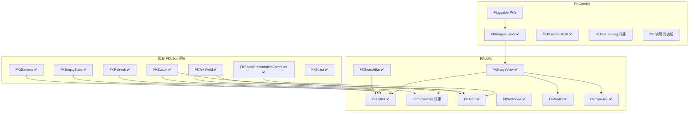

# FKKit 组件缺口与优先级分析

基于当前代码库（`Sources/`、`Examples/`、`docs/`）的**现状审阅**文档：梳理已交付能力、结构性缺口、值得补充的组件/模块，以及推荐实施顺序。

**文档类型：** 分析报告（活文档，随代码库演进更新）  
**审阅基准：** 2026 年 6 月，`develop` 分支源码树  
**读者：** 维护者、贡献者、规划 FKKit 接入的产品/工程团队  
**关联文档：** [COMPONENT_ROADMAP.md](COMPONENT_ROADMAP.md)（迭代路线图与设计约束）

---

## 目录

- [1. 文档目的与分析方法](#1-文档目的与分析方法)
- [2. 项目现状总览](#2-项目现状总览)
- [3. FKCoreKit 已交付能力详表](#3-fkcorekit-已交付能力详表)
- [4. FKUIKit 已交付能力详表](#4-fkuikit-已交付能力详表)
- [5. 相对路线图的新增交付（2026 上半年）](#5-相对路线图的新增交付2026-上半年)
- [6. 结构性缺口摘要](#6-结构性缺口摘要)
- [7. Tier 1 — 最高优先级（仍缺）](#7-tier-1--最高优先级仍缺)
- [8. Tier 2 — 高价值第二波（仍缺或未完成）](#8-tier-2--高价值第二波仍缺或未完成)
- [9. Tier 3 — 垂直场景 / 较低频率](#9-tier-3--垂直场景--较低频率)
- [10. 现有模块增强项](#10-现有模块增强项)
- [11. Pluggable 契约缺口](#11-pluggable-契约缺口)
- [12. SwiftUI Bridge 覆盖缺口](#12-swiftui-bridge-覆盖缺口)
- [13. 跨组件依赖与推荐实施顺序](#13-跨组件依赖与推荐实施顺序)
- [14. 分阶段交付建议](#14-分阶段交付建议)
- [15. 选型决策树（已有 vs 待建）](#15-选型决策树已有-vs-待建)
- [16. 风险与注意事项](#16-风险与注意事项)
- [17. 相关设计文档索引](#17-相关设计文档索引)
- [18. 修订历史](#18-修订历史)

---

## 1. 文档目的与分析方法

### 1.1 目的

FKKit 已覆盖大量 iOS 业务 App 常见需求，但在「**用 FKKit 快速搭起典型业务 App**」这一目标上，仍存在若干**高频、结构性**空白。本文档回答：

1. **现在有什么** — 按模块列出成熟度与典型场景；
2. **还缺什么** — 按业务频率与 FKKit 协同价值分级；
3. **先做什么** — 依赖关系与分阶段建议；
4. **不要重复造什么** — 与现有组件的边界。

本文档侧重**现状分析**；具体 API 草案、目录规范、交付检查清单见 [COMPONENT_ROADMAP.md](COMPONENT_ROADMAP.md) 及各 `*_DESIGN.md`。

### 1.2 分析方法

| 维度 | 审阅内容 |
|------|----------|
| 源码树 | `Sources/FKCoreKit/Components/`、`Sources/FKUIKit/Components/` 顶层目录与 README |
| Pluggable | 协议组 vs 库内默认实现 |
| Examples | `Examples/FKKitExamples/` Hub/场景 vs 公开 API 面 |
| 设计文档 | `docs/` 下路线图与各组件设计需求 |
| 频率启发式 | 中大型 iOS App 中重复实现同一 UIKit/基础设施模式的常见程度 |
| 协同度 | 新组件能否串联已有 Refresh、EmptyState、Skeleton、Sheet 等 |

**分级标准：**

- **Tier 1**：几乎每 App 都需要；缺了会导致大量重复样板代码；
- **Tier 2**：高价值、第二波；显著改善体验或补齐 Pluggable/基础设施；
- **Tier 3**：垂直场景或较低频率；按需引入。

---

## 2. 项目现状总览

FKKit 分为两个 SPM/CocoaPods 产品：

| 产品 | 定位 | 顶层组件/领域数（约） |
|------|------|------------------------|
| **FKCoreKit** | 基础设施、工具、Pluggable 契约；**不含 UIKit 视图** | 13 个领域 |
| **FKUIKit** | 可复用 UIKit 控件与组合流程；依赖 FKCoreKit | 25+ 独立组件 + Widgets 子库 |

**技术约束（全库统一）：** Swift 6、iOS 15+、零第三方运行时依赖、英文公开 API、`Sendable` 配置、UI 工作 `@MainActor`。

**整体成熟度判断：**

- **基础设施层（FKCoreKit）**：网络、存储、日志、权限、安全、文件、异步、BusinessKit、I18n 等已**生产可用**；部分 Pluggable 组仍**仅协议、无参考实现**。
- **UI 层（FKUIKit）**：Toast、Sheet、Refresh、TextField、Player、Sheet 呈现等已**非常完整**；2026 上半年补齐了图片、搜索、WebView、生物识别及大量 Widgets。
- **最大剩余空洞**：**独立表单控件族（FKFormControls）**。（**FKListKit**、**FKAlert** v1 已交付，见 §5 / §7.1 / §7.3。）

---

## 3. FKCoreKit 已交付能力详表

| 领域 | 路径 | 成熟度 | 主要能力 | 典型场景 |
|------|------|--------|----------|----------|
| **Pluggable** | `Components/Pluggable/` | 仅契约 | 网络、埋点、存储、会话、路由、日志、生命周期、图片、列表 Cell、文本格式化等协议 | App 组合根 DI；中大型 App 边界 |
| **Network** | `Components/Network/` | 生产可用 | URLSession 栈、拦截器、缓存、上传下载、Token 刷新、可达性、去重 | REST API、文件传输 |
| **Storage** | `Components/Storage/` | 生产可用 | UserDefaults、Keychain、文件、内存；Codable | 配置、凭证、本地缓存 |
| **Logger** | `Components/Logger/` | 生产可用 | 结构化日志、格式化、文件持久化 | 调试、线上诊断 |
| **Permissions** | `Components/Permissions/` | 生产可用 | 相机、相册、麦克风、定位、通知等；预提示、跳转设置 | 权限引导流 |
| **Security** | `Components/Security/` | 生产可用 | 哈希、AES、RSA、HMAC、编码、签名、脱敏 | 加密通信、本地安全 |
| **FileManager** | `Components/FileManager/` | 生产可用（ZIP 除外） | 沙盒 I/O、断点上传下载、缓存；**ZIP API 存在但可能返回 `.zipUnavailable`** | 文件管理、离线包 |
| **Async** | `Components/Async/` | 生产可用 | 主线程调度、防抖、节流、任务组、执行器 | 搜索防抖、并发控制 |
| **BusinessKit** | `Components/BusinessKit/` | 生产可用 | 版本更新、埋点、DeepLink、生命周期、**UIAlertController 封装**、启动任务 | App 壳层业务 |
| **I18n** | `Components/I18n/` | 生产可用 | 语言管理、观察、MessageFormat | 多语言 |
| **Extension** | `Components/Extension/` | 生产可用 | Foundation / CoreGraphics / UIKit `fk_*` 扩展、`FKDeviceInfo` | 横切便利 API；列表扩展仍较薄 |
| **ImageLoader** | `Components/ImageLoader/` | 生产可用 | 默认 `FKImageLoading` / `FKImageCaching` 实现 | 远程图片、磁盘/内存缓存 |
| **BiometricAuth** | `Components/BiometricAuth/` | 生产可用 | Face ID / Touch ID / 密码回退；`LocalAuthentication` | 金融、账号安全 |

---

## 4. FKUIKit 已交付能力详表

### 4.1 核心 UI 组件

| 组件 | 路径 | 成熟度 | 主要能力 | 典型场景 |
|------|------|--------|----------|----------|
| **ActionSheet** | `ActionSheet/` | 生产可用 | 底部/居中/Popover 操作表、选择、Toggle 行、校验、SwiftUI Modifier | 操作菜单、迁移 UIAlertController |
| **Badge** | `Badge/` | 生产可用 | 视图/Bar/Tab 角标、锚定、动画 | 未读数、红点 |
| **BlurView** | `BlurView/` | 生产可用 | 视图/图片模糊、SwiftUI、IB | 毛玻璃、背景 |
| **Button** | `Button/` | 生产可用 | 样式、加载态、触觉、无障碍、全局样式 | 主/次/破坏性按钮 |
| **Callout** | `Callout/` | 生产可用 | Tooltip、Popover、尖角布局、SwiftUI 桥接 | 引导、说明 |
| **Carousel** | `Carousel/` | 生产可用 | 横向分页、自动滚动、ImageBanner 预设、SwiftUI | 首页 Banner、广告位 |
| **CornerShadow** | `CornerShadow/` | 生产可用 | 圆角矩形、边框、渐变、阴影路径 | 卡片视觉 |
| **Divider** | `Divider/` | 生产可用 | 发丝线、虚线、渐变分隔 | 列表分隔 |
| **EmptyState** | `EmptyState/` | 生产可用 | 加载/空态/错误叠加、分层配置、插槽 | 列表空态、错误重试 |
| **ExpandableText** | `ExpandableText/` | 生产可用 | Label/TextView 展开收起、SwiftUI | 长文案 |
| **FlowVisualization** | `FlowVisualization/` | 生产可用 | **StepIndicator**（步骤条）、**Timeline**（时间线） | 结账、物流、审计 |
| **ImageView** | `ImageView/` | 生产可用 | 远程加载、占位、失败重试、SwiftUI Representable | 信息流、头像源 |
| **PagingController** | `PagingController/` | 生产可用 | 子 VC 分页 + TabBar 同步 | 频道切换 |
| **PhotoPicker** | `PhotoPicker/` | 生产可用 | PHPicker/相机封装、权限、压缩 | 上传头像、UGC |
| **Player** | `Player/` | 生产可用 | 视频（PiP、字幕、HLS）；音频（队列、歌词） | 媒体播放 |
| **ProgressBar** | `ProgressBar/` | 生产可用 | 线性/环形、缓冲、分段、SwiftUI | 进度、加载 |
| **RatingControl** | `RatingControl/` | 生产可用 | 交互/只读评分、SwiftUI | 评价、筛选 |
| **Refresh** | `Refresh/` | 生产可用 | 下拉刷新、加载更多、分页模型、SwiftUI | 列表刷新 |
| **SearchBar** | `SearchBar/` | 生产可用 | 防抖搜索、取消/清除、导航栏嵌入、SwiftUI | 搜索页、筛选 |
| **SheetPresentationController** | `SheetPresentationController/` | 生产可用 | 底部/顶部/居中 Sheet、Detent、锚点下拉 | 模态、半屏 |
| **Skeleton** | `Skeleton/` | 生产可用 | 视图/列表/容器骨架屏 | 首屏加载 |
| **TabBar** | `TabBar/` | 生产可用 | CollectionView Tab 头、指示器、角标 | 顶部分类 Tab |
| **TextField** | `TextField/` | 生产可用 | 格式化输入、OTP、计数、校验、SwiftUI | 表单文本 |
| **Toast** | `Toast/` | 生产可用 | Toast/HUD/Snackbar 队列、SwiftUI 承载 | 轻提示 |
| **ListKit** | `ListKit/` | 生产可用 | Diffable Table/Collection VC、预设行、滑动操作、Refresh/Empty/Skeleton 集成 | 信息流、设置页 |
| **Alert** | `Alert/` | 生产可用 | 居中确认框、单行输入、队列/去重、危险操作门控、SwiftUI Modifier | 删除确认、重命名提示 |

### 4.2 Widgets 子库（`Components/Widgets/`）

| 组件 | 路径 | 说明 |
|------|------|------|
| **FKChip / FKTag / FKChipGroup** | `Widgets/Chip/` | 可选/只读标签、筛选组；含 SwiftUI Bridge |
| **FKAvatar / FKAvatarGroup / FKPresenceIndicator** | `Widgets/Avatar/` | 头像、堆叠、在线状态 |
| **FKStatusPill** | `Widgets/StatusPill/` | 工作流状态胶囊（与 Tag 营销色区分） |
| **FKCopyChip** | `Widgets/CopyChip/` | 可复制文本胶囊 + Toast 反馈 |
| **FKIconView** | `Widgets/IconView/` | 统一图标渲染（SF Symbol / 图片） |
| **FKMarqueeLabel** | `Widgets/Marquee/` | 公告滚动文字 |
| **Core** | `Widgets/Core/` | 胶囊布局、状态色令牌等共享 primitive |

### 4.3 FKUIKit Core（`Sources/FKUIKit/Core/`）

当前提供 **`FKLayerBorderStyle`**、**`FKLayerShadowStyle`** 等外观 primitive，以及资源/i18n 包 — **尚未形成完整设计令牌或 Theme 系统**（见 Tier 3 `FKTheme`）。

---

## 5. 相对路线图的新增交付（2026 上半年）

[COMPONENT_ROADMAP.md](COMPONENT_ROADMAP.md) 初版（2026-06-08）基线中标记为缺口、**现已落地**的主要项：

| 路线图条目 | 当前状态 | 说明 |
|------------|----------|------|
| §1.1 FKImageLoader + FKImageView | ✅ 已交付 | `FKCoreKit/ImageLoader` + `FKUIKit/ImageView` |
| §1.3 FKSearchBar / FKSearchField | ✅ 已交付 | `FKUIKit/SearchBar` |
| §1.6 FKWebView | ✅ 已交付 | `FKUIKit/WebView` |
| §1.7 FKBiometricAuth | ✅ 已交付 | `FKCoreKit/BiometricAuth` |
| §2.2 FKChip / FKTag | ✅ 已交付 | `FKUIKit/Widgets/Chip` |
| §2.3 FKAvatar | ✅ 已交付 | `FKUIKit/Widgets/Avatar` |
| §2.4 FKCarousel / FKImageBanner | ✅ 已交付 | `FKUIKit/Carousel` |
| §2.6 FKPhotoPicker | ✅ 已交付 | `FKUIKit/PhotoPicker` |
| §2.7 FKStepIndicator / FKTimeline | ✅ 已交付 | `FKUIKit/FlowVisualization` |
| §1.2 FKListKit | ✅ 已交付 | `FKUIKit/ListKit` — Table/Collection Diffable 基类、预设行、Examples |
| §1.5 FKAlert | ✅ 已交付 | `FKUIKit/Alert` — 居中确认框、队列/去重、SwiftUI Modifier、12+ Examples |
| Tier 3 FKMarquee | ✅ 已交付 | `FKUIKit/Widgets/Marquee` |
| 小组件扩展 | ✅ 部分交付 | StatusPill、CopyChip、IconView 等 |

**路线图仍标记为缺口、尚未落地**的核心项见下文 §7–§9。

---

## 6. 结构性缺口摘要

日常集成摩擦仍主要来自两类结构性空洞（列表页 **FKListKit v1 已交付**，见 §7.1）：

| 主题 | 缺口描述 | 业务影响 |
|------|----------|----------|
| **列表** | ~~无 Diffable 列表 Controller~~ → **FKListKit v1 已交付**（`ListKit/`）；UITableView Extension 仍较薄 | 典型 App 列表页可复用基类；Extension 级 Diffable 便利方法仍为可选增强 |
| **表单控件** | `FKTextField` 强；**无独立 SegmentedControl、Toggle、Checkbox、RadioGroup、Slider** | 设置页、筛选栏、引导页缺乏统一 FK 视觉语言 |
| **确认对话框** | ~~无 FK 风格居中 Alert~~ → **FKAlert v1 已交付**（`Alert/`）；`FKBusinessAlertManager` 仍保留系统路径 | 品牌化确认/输入弹窗已可用；BusinessKit 后端开关待 v1.1 |

**次要但仍有价值的缺口：** 内嵌 Banner、日期/滚轮选择器、键盘 Toolbar、ZIP 真正实现、Feature Flag 参考实现、Theme 体系、部分 SwiftUI Bridge、QR/Accordion/Form 等垂直能力。

---

## 7. Tier 1 — 最高优先级（部分仍缺）

> 频率：⭐⭐⭐⭐⭐（几乎每 App）  
> **FKListKit**、**FKAlert** 已交付（§7.1、§7.3）；下列 **FormControls** 仍为 Tier 1 缺口。  
> 详细设计：[FKListKit_DESIGN.md](FKListKit_DESIGN.md)、[FKFormControls_DESIGN.md](FKFormControls_DESIGN.md)、[FKAlert_DESIGN.md](FKAlert_DESIGN.md)

### 7.1 FKListKit（Diffable 列表基础设施）— ✅ 已交付（v1）

**模块：** `FKUIKit/Components/ListKit/`  
**状态：** v1 已实现 — Table + Collection Diffable 基类、预设行、滑动操作（Table）、Refresh/Empty/Skeleton 集成、17+ Examples。  
**设计文档（活文档）：** [FKListKit_DESIGN.md](FKListKit_DESIGN.md)

**已交付摘要**

| 类型 | 职责 |
|------|------|
| `FKListSection` / `FKListItem` / `FKListSnapshot` | Diffable 模型 + mutation |
| `FKDiffableTableViewController` | Table 基类 + 刷新/分页/空态/骨架 |
| `FKDiffableCollectionViewController` | Compositional 预设（list/grid/insetGrouped） |
| `FKListPresetItem` | 七种预设行 + handler registry |
| `FKListSwipeActionConfiguration` | Table 滑动操作 |

**后续演进（非 v1 阻塞）：** FKCellKit 预设映射、Collection swipe、`presetRows` skeleton、SwiftUI Bridge — 见设计文档 §26。

---

### 7.2 FKFormControls（表单与筛选控件族）

**模块：** `FKUIKit/Components/FormControls/`（建议目录名）

**问题陈述**

- `FKActionSheet` 含 Toggle **行**，非可嵌入任意布局的独立控件；
- `FKTextField` 覆盖文本，不覆盖二元/枚举/区间输入；
- `UISlider` 等系统控件仅在 Player 内部使用，未形成 FK 风格独立 API。

**拟议控件**

| 控件 | 关键特性 | 典型场景 |
|------|----------|----------|
| **FKSegmentedControl** | 文本/图标分段、角标、动画指示器（可参考 TabBar）、等宽/自适应、RTL | 筛选 Tab、视图模式切换 |
| **FKToggle** | 与 Button 配色一致的开关；加载/禁用态 | 设置开关 |
| **FKCheckbox** | 可选半选态；VoiceOver 组语义 | 协议勾选、多选 |
| **FKRadioGroup** | 强制单选；水平/垂直布局 | 性别、支付方式 |
| **FKSlider** | 单值/区间（双拇指）、步进吸附、数值标签、可选触觉 | 价格区间、音量 |

**设计约束**

- 配置分层对齐 `FKButton` / `FKRatingControl`（appearance / layout / interaction / accessibility）；
- 均为 `UIControl` 事件模型；各控件提供 SwiftUI `Representable`；
- 与 ActionSheet Toggle **行**、TabBar segmented 预设的选用边界须写入 README 决策树。

**Examples 最低场景**

- 筛选栏：Segment + 区间 Slider；
- 设置表单：Toggle + RadioGroup + Checkbox；
- 禁用/加载态全家一致演示。

---

### 7.3 FKAlert（自定义居中确认框）— ✅ 已交付（v1）

**模块：** `FKUIKit/Components/Alert/`  
**状态：** v1 已实现 — 居中 Sheet 确认框、单行输入、队列/去重、危险操作门控、SwiftUI `fkAlert`、12+ Examples。  
**设计文档（活文档）：** [FKAlert_DESIGN.md](FKAlert_DESIGN.md)

**已交付摘要**

| 类型 | 职责 |
|------|------|
| `FKAlertContent` / `FKAlertConfiguration` | Sendable 声明式内容与视觉/交互策略 |
| `FKAlertViewController` + `FKAlertContentView` | 自适应正文滚动、勾选门控、`FKTextField` |
| `FKAlertPresenter` / `FKAlertCoordinator` | `present` / `presentOnce` / `dismiss` / `setLoading` |
| `FKAlert` | `confirm` / `prompt` 便捷 API |
| `FKAlertPresets` | `destructiveConfirm` / `informational` / `textPrompt` |
| `FKAlertModifier` | SwiftUI Binding 桥接 |

**与 ActionSheet / Toast 边界**

| 需求 | 选用 |
|------|------|
| 底部多操作、Toggle 行、Popover | `FKActionSheet` |
| 居中破坏性确认、阻塞式错误、单行输入 | **`FKAlert`** |
| 短暂非模态提示 | `FKToast` |
| 系统 chrome、无 FKUIKit 样式 | `FKBusinessAlertManager` |

**后续演进（非 v1 阻塞）：** BusinessKit `FKBusinessAlertBackend` 开关、`FKCheckbox` 替代 `UISwitch`、自定义内容区 — 见设计文档 §23。

---

## 8. Tier 2 — 高价值第二波（仍缺或未完成）

### 8.1 FKBanner / FKNoticeBar

**与 Toast 的区别：** 内容区顶部/底部**持久**条带；支持操作按钮与滑动关闭；**不走**全局 Toast 队列。

| 方面 | 说明 |
|------|------|
| 场景 | App 升级提示、离线模式、账号验证、维护公告 |
| 集成 | Safe Area inset；多条 Banner 按优先级堆叠 |
| 复用 | `FKButton`、`CornerShadow`、`FKUIKitI18n` |

**频率：** ⭐⭐⭐⭐ — 消费级 App 几乎都有「顶部黄条」类需求。

---

### 8.2 FKDatePicker / FKPicker

| 组件 | 说明 |
|------|------|
| **FKDatePicker** | 滚轮/日历/紧凑样式；日期、时间、日期+时间；范围限制；locale/时区来自 `FKI18n`；Sheet 呈现 |
| **FKPicker** | 单/多列滚轮；工具栏完成/取消；桥接 `FKSheetPresentationController` |

**频率：** ⭐⭐⭐⭐ — 预约、生日、筛选日期区间。

**依赖：** `FKSheetPresentationController`、`FKButton`、`FKI18n`。

---

### 8.3 FKKeyboardToolbar

**说明：** `inputAccessoryView` 工具栏 — 上一项/下一项/完成；与 `FKTextField` 或多输入表单配合。

**频率：** ⭐⭐⭐ — 多字段表单、登录注册页体验提升。

**可选协同：** 未来 `FKFormFocusCoordinator` 或扩展 TextField Manager。

---

### 8.4 ZIP — 补全 FileManager 实现

**现状：** `FKFileStorageCore` 中 ZIP 压缩/解压 API 已暴露，执行路径可能 **`throw FKFileManagerError.zipUnavailable`**。

**目标：** 在支持系统上使用 Archive.framework，或文档化明确回退与能力门控。

**频率：** ⭐⭐⭐ — 离线包、日志打包、导入导出场景。

---

### 8.5 FKSearchViewController（搜索页组合）

**模块：** `FKUIKit/Components/SearchViewController/`

**问题陈述**

- **`FKSearchBar`** 与 **`FKListKit`** 已交付，但搜索页仍由各 App 手写：`UISearchBar` + `tableHeaderView` frame、Task 取消、空结果与 loading 态分散；
- `FKListKitSearchFilterExampleViewController` 仍使用系统 `UISearchBar`，未体现 FKKit 推荐路径。

**拟议能力**

| 能力 | 说明 |
|------|------|
| **组合 VC** | `FKSearchBar` + 子 `FKDiffableTableViewController` + 状态机 |
| **双模式** | 本地内存筛选 / 远程 async provider |
| **放置** | 导航栏、粘性顶栏、tableHeader |
| **集成** | `FKEmptyState`（`.noSearchResult`）、`FKSkeleton`、SearchBar loading |

**频率：** ⭐⭐⭐⭐ — 与 SearchBar 场景重叠的**页面级**缺口；减少列表 MVP 之后仍重复的样板代码。

**依赖：** `FKSearchBar` ✅、`FKListKit` ✅、`FKEmptyState` ✅、`FKSkeleton` ✅。

**详细设计需求：** [FKSearchViewController_DESIGN.md](FKSearchViewController_DESIGN.md)

---

### 8.6 FKFeatureFlag — 默认适配器

**现状：** `FKFeatureFlagProviding` / `FKRemoteConfigProviding` 在 Pluggable 中**仅协议**。

**目标：**

- 内存版 `FKFeatureFlagProviding` — 测试与小 App；
- 可选远程适配器草案（端点由宿主提供，符合 Pluggable）。

**频率：** ⭐⭐⭐ — 中大型 App 多自建；小团队需要参考实现降低接入成本。

---

### 8.7 SwiftUI Bridge 扩展（见 §12）

对**已交付 UIKit 组件**回填 Representable，降低 SwiftUI 混合栈摩擦 — 见下文详细表。

---

## 9. Tier 3 — 垂直场景 / 较低频率

按需引入；避免过早扩大 API 面与维护负担。

| 组件 | 模块 | 说明 | 频率 |
|------|------|------|------|
| **FKTheme** | FKUIKit Core | 设计令牌：颜色角色、字阶、间距；深色模式与 Dynamic Type | 中 — 组件增多后统一视觉 |
| **FKForm** | FKUIKit | 跨字段校验编排、提交门控；依赖 FormControls + TextField | 中 |
| **FKQRCode** | FKCoreKit + FKUIKit | `CIFilter` 生成 + `AVFoundation` 扫描 UI；权限走 `FKPermissions` | 中 — 支付、登录 |
| **FKAccordion** | FKUIKit | FAQ/设置折叠面板；单/多段展开 | 中 |
| **FKShareSheet** | FKUIKit | `UIActivityViewController` + `FKFileManager` 分享辅助 | 中 |
| **FKLocalNotificationManager** | FKCoreKit | `UserNotifications` 调度/取消；权限走 `FKPermissions` | 低–中 |
| **FKBackgroundTaskManager** | FKCoreKit | `BGTaskScheduler` + `beginBackgroundTask`；与 FileManager 后台 URLSession 分层 | 低–中 |

**详细设计需求：** [FKLocalNotificationManager_DESIGN.md](FKLocalNotificationManager_DESIGN.md)；[FKBackgroundTaskManager_DESIGN.md](FKBackgroundTaskManager_DESIGN.md)

---

## 10. 现有模块增强项

以下**非全新组件**，但应与版本列车一并推进，提升整体「生产可用」体感。

### 10.1 FKNetwork（`FKCoreKit`）

路线图条目（见 `Components/Network/README.md`）：

| 增强项 | 价值 | 说明 |
|--------|------|------|
| SSL Pinning 示例与文档 | ⭐⭐⭐⭐ | 当前为基础 challenge 处理；金融/企业 App 需要严格 Pinning 指引 |
| Multipart 上传辅助 | ⭐⭐⭐⭐ | Boundary 构建、文件分片 |
| 重试策略预设 | ⭐⭐⭐ | 指数退避、仅幂等方法 |
| Mock URLSession 模板 | ⭐⭐⭐ | 文档 + 示例代码，便于集成测试 |
| Pluggable / Reachability 桥接 | ⭐⭐⭐ | `FKAPIClientProviding`、双协议 Reachability |
| 基线能力 Examples | ⭐⭐⭐ | 缓存、去重、401、离线预检等已交付路径演示 |

**详细设计需求：** [FKNetwork_DESIGN.md](FKNetwork_DESIGN.md)（完整模块设计）；增量索引 [FKNetwork_ENHANCEMENT_DESIGN.md](FKNetwork_ENHANCEMENT_DESIGN.md)。

### 10.2 FKFileManager（`FKCoreKit`）

- 交付可用 ZIP 或明确 OS 能力门控；
- 文档化后台传输限制与恢复流程；
- Multipart 与 Network 统一 builder（见 Network/FileManager 设计分工）；
- 基线能力 FKKitExamples（断点下载、上传、快照、分享预览）。

**详细设计需求：** [FKFileManager_DESIGN.md](FKFileManager_DESIGN.md)（完整模块设计）；增量索引 [FKFileManager_ENHANCEMENT_DESIGN.md](FKFileManager_ENHANCEMENT_DESIGN.md)。

### 10.3 FKBusinessKit（`FKCoreKit`）

- 评估 `FKBusinessAlertBackend`（`systemAlert` / `fkAlert`）配置开关（v1.1）；v1 与 `FKAlert` 长期共存。
- Pluggable 桥接（Lifecycle / Deeplink / Analytics）。
- 公开或迁移 `FKTopViewControllerResolver` 至 Extension。
- Examples Hub 分场景（Version/Track/I18n/Lifecycle/Deeplink/Utils）。

**详细设计需求：** [FKBusinessKit_DESIGN.md](FKBusinessKit_DESIGN.md)（完整模块设计）；增量索引 [FKBusinessKit_ENHANCEMENT_DESIGN.md](FKBusinessKit_ENHANCEMENT_DESIGN.md)。

### 10.4 FKExtension（`FKCoreKit`）

- 若未被 FKListKit 完全吸收：扩展 `UITableView` / `UICollectionView` Diffable 便利方法；
- 统一 Pluggable 相关的 `fk_register` / `fk_dequeue` 辅助 — 文档化单一入口。

### 10.5 Player / Sheet / TextField（维护）

- 持续补齐 SwiftUI Bridge parity；
- 每版 HIG 合规审查（44pt 触控、VoiceOver）。

---

## 11. Pluggable 契约缺口

| 协议组 | 当前状态 | 建议动作 |
|--------|----------|----------|
| `FKImageLoading` / `FKImageCaching` | ✅ `FKImageLoader` 参考实现 | 文档标注为默认注入示例 |
| `FKListTableCellConfigurable` / `FKListCollectionCellConfigurable` | 协议 + 注册辅助 | **FKListKit** Cell 应遵循；Examples 提供示例 Cell |
| `FKTextFormatting` / `FKTextValidating` | 仅协议 | Tier 3 `FKForm` 或 TextField 扩展共享校验器 |
| `FKFeatureFlagProviding` / `FKRemoteConfigProviding` | 仅协议 | Tier 2 内存 + 远程适配器 |
| `FKNetworkReachabilityProviding` | Network 已实现 | 为 ImageView / WebView 离线 UI 暴露统一桥接 |
| `FKUserSessionProviding` 等 | 仅协议 | 保持 App 侧实现；BusinessKit 可补充 Examples |

**详细设计需求：** [FKPluggable_ENHANCEMENT_DESIGN.md](FKPluggable_ENHANCEMENT_DESIGN.md) — 参考实现、模块桥接、组合根、Mock 套件与 v2 协议组。

**原则：** 添加默认实现**不强制** App 使用 — 中大型 App 仍以协议注入为主。

---

## 12. SwiftUI Bridge 覆盖缺口

### 12.1 已交付 Bridge（Representable / Modifier / 承载 API）

| 组件 | Bridge |
|------|--------|
| BlurView | `FKSwiftUIBlurView` |
| ActionSheet | `FKActionSheetModifier` |
| Callout | `FKCalloutSwiftUIBridge` |
| ExpandableText | `FKExpandableTextView` |
| PagingController | `FKPagingControllerRepresentable` |
| ProgressBar | `FKProgressBarSwiftUIView` |
| RatingControl | `FKRatingControlRepresentable` |
| Refresh | `FKRefreshSwiftUIBridge` |
| TabBar | `FKTabBarRepresentable` |
| TextField | `FKTextFieldRepresentable` |
| Player | `FKVideoPlayerSwiftUIView`、`FKAudioPlayerSwiftUIView` |
| Toast | SwiftUI 内容承载 API |
| ImageView | `FKImageViewRepresentable` |
| SearchBar / SearchField | `FKSearchBarRepresentable`、`FKSearchFieldRepresentable` |
| WebView | `FKWebViewRepresentable` |
| Carousel / ImageBanner | `FKCarouselRepresentable`、`FKImageBannerRepresentable` |
| Widgets | Chip、Tag、Avatar、Marquee、IconView、CopyChip、StatusPill 等 |
| FlowVisualization | StepIndicator、Timeline Representable |
| PhotoPicker | `FKPhotoPickerButton` 等 |

### 12.2 仍缺 Bridge（建议优先级）

| 组件 | 拟议 Bridge | 优先级 | 说明 |
|------|-------------|--------|------|
| **FKButton** | `FKButtonRepresentable` | **P1** | 使用极广；SwiftUI 混合栈高频 |
| **FKEmptyState** | `FKEmptyStateRepresentable` | **P1** | 列表/详情空态 |
| **FKAlert** | `FKAlertModifier` / Binding API | **P1** | ✅ 已随 Alert v1 交付 |
| **FormControls**（待建） | 各控件独立 Representable | **P1** | 随 FormControls 交付 |
| **FKBadge** | `FKBadgeRepresentable` | P2 | Tab/导航角标 |
| **FKSkeleton** | `FKSkeletonRepresentable` | P2 | 加载占位 |
| **FKDivider** | `FKDividerRepresentable` | P3 | 相对简单 |
| **FKListKit** | 宿主封装或 Cell Builder | P2 | SwiftUI Bridge 第二阶段 |

**原则：** Bridge 保持轻薄；业务逻辑留在 UIKit 类型中；共享 `Sendable` 配置结构体。

---

## 13. 跨组件依赖与推荐实施顺序

### 13.1 依赖关系图

### 13.2 推荐实施顺序（尊重依赖）

| 顺序 | 交付物 | 理由 |
|------|--------|------|
| 1 | ~~**FKListKit**~~ | ✅ 已交付（2026-06） |
| 2 | **FKFormControls**（Segment + Toggle 优先） | 设置/筛选页刚需；可与 ListKit 预设 Cell 联动 |
| 3 | ~~**FKAlert**~~ | ✅ 已交付（2026-06） |
| 4 | **FKBanner**、**FKDatePicker/Picker**、**FKKeyboardToolbar** | 完善通知与表单体验 |
| 5 | **ZIP**、**FKFeatureFlag**、**SwiftUI Bridge 回填** | 基础设施与混合栈 |
| 6 | **FKTheme**、Tier 3 垂直组件 | 视觉统一与专业化 |

---

## 14. 分阶段交付建议

与 [COMPONENT_ROADMAP.md — 分阶段发布计划](COMPONENT_ROADMAP.md#分阶段发布计划) 对齐，并结合**当前已交付项**更新如下：

| 阶段 | 交付物 | 主题 | 状态（2026-06） |
|------|--------|------|-----------------|
| **A** | FKImageLoader、FKImageView | 图片能力 | ✅ 已完成 |
| **B** | FKListKit（Table）、FKSearchBar | 列表页 MVP | ✅ 已完成 |
| **C** | FKListKit（Collection）、FKSegmentedControl、FKToggle | 列表 + 基础表单 | ListKit Collection ✅；FormControls ⏳ |
| **D** | FKCheckbox、FKRadioGroup、FKSlider、~~FKAlert~~ | 表单 + 确认流 | Alert ✅；FormControls ⏳ |
| **E** | FKWebView、FKBiometricAuth | 混合内容 + 安全 | ✅ 已完成 |
| **F** | FKBanner、FKChip、ZIP 补全 | 通知条 + 修复 | Chip ✅；Banner/ZIP ⏳ |
| **G** | FKAvatar、FKCarousel、FKFeatureFlag | 富媒体 UI | Avatar/Carousel ✅；FeatureFlag ⏳ |
| **H** | FKDatePicker、FKPicker、FKPhotoPicker | 选择器 | PhotoPicker ✅；Date/Picker ⏳ |
| **I** | FKStepIndicator、FKTimeline、FKKeyboardToolbar | 流程 + 表单 | Step/Timeline ✅；Toolbar ⏳ |
| **J** | Tier 3、`FKTheme`、`FKForm` | 打磨与专业化 | ⏳ |

每阶段交付应满足：PR → `xcodebuild` 验证 → `CHANGELOG.md` → 根 `README.md` 索引 → FKKitExamples Hub + 场景。

---

## 15. 选型决策树（已有 vs 待建）

启动新功能前，**优先使用已有 FKKit 模块**，避免重复实现：

| 用户需求 | 应使用（勿重建） | 若缺失则 |
|----------|------------------|----------|
| 远程图片 + 占位 + 失败重试 | `FKImageView` + `FKImageLoader` | — |
| 底部操作菜单 | `FKActionSheet` | — |
| 居中破坏性确认 / 单行输入弹窗 | **`FKAlert`** | — |
| 短暂浮层消息 | `FKToast` | — |
| 持久顶部/底部通知条 | — | 待 **`FKBanner`** |
| 加载占位 | `FKSkeleton` | — |
| 下拉刷新 / 加载更多 | `FKRefresh` + `FKRefreshPagination` | — |
| Diffable 列表 VC 基类 | **`FKListKit`**（`FKDiffableTableViewController` / Collection） | — |
| 空态 / 错误 / 加载叠加 | `FKEmptyState` | — |
| Tab + 滑动分页 | `FKTabBar` + `FKPagingController` | — |
| 搜索 + 防抖 | `FKSearchBar` / `FKSearchField` | — |
| 格式化文本输入 | `FKTextField`、`FKCodeTextField` | — |
| 开关 / 分段 / 滑块（独立嵌入） | ActionSheet Toggle **行**（仅适合 Sheet 内） | 待 **`FKFormControls`** |
| 模态 / Sheet / Detent | `FKSheetPresentationController` | — |
| H5 / OAuth / 协议页 | `FKWebView` | — |
| 生物识别 | `FKBiometricAuth` | — |
| HTTP / 缓存 / 上传 | `FKNetwork`、`FKFileManager` | — |
| 加密 / 签名 | `FKSecurity` | — |
| 防抖 / 主线程 | `FKAsync` | — |
| 筛选标签 / 元数据 Tag | `FKChip` / `FKTag` / `FKChipGroup` | — |
| 头像 / 在线状态 | `FKAvatar` / `FKPresenceIndicator` | — |
| 轮播 Banner | `FKCarousel` / `FKImageBanner` | — |
| 步骤条 / 物流时间线 | `FKStepIndicator` / `FKTimeline` | — |

---

## 16. 风险与注意事项

| ID | 主题 | 风险 | 缓解 |
|----|------|------|------|
| R1 | FKListKit 范围膨胀 | 易做成完整 App 框架 | v1 已交付薄基类；预设增量 / CellKit 映射见设计文档 §26 |
| R2 | ZIP 支持 | Archive.framework 可用性 | 特性检测；未完成前保留 `.zipUnavailable` 文档 |
| R3 | Alert / ActionSheet / Toast 边界 | 集成方选型混淆 | README 决策树（§15） |
| R4 | SwiftUI 双栈维护 | API 面扩大 | 轻薄 Representable；共享配置结构体 |
| R5 | 组件增多 | 编译时间与认知负担 | 单 Product；文档索引清晰；Examples Hub |

**维护者待决（摘自路线图）：**

1. ~~`FKListKit` 单文件夹 vs 拆分？~~ → **已决：`ListKit/`**（见 [FKListKit_DESIGN.md](FKListKit_DESIGN.md) §27）
2. `FKAlert` 与 `FKBusinessAlertManager` **v1 长期共存**；BusinessKit 后端开关见 [FKAlert 设计](FKAlert_DESIGN.md) §23 / §27 Q3。
3. SwiftUI Bridge 回填的最低清单（P1）何时作为发版门槛？

---

## 17. 相关设计文档索引

| 文档 | 内容 |
|------|------|
| [FKTheme_DESIGN.md](FKTheme_DESIGN.md) | 设计令牌与主题体系 |
| [FKQRCode_DESIGN.md](FKQRCode_DESIGN.md) | QR 生成与扫描 |
| [FKBanner-FKNoticeBar_DESIGN.md](FKBanner-FKNoticeBar_DESIGN.md) | 持久通知条 |
| [FKNetwork_ENHANCEMENT_DESIGN.md](FKNetwork_ENHANCEMENT_DESIGN.md) | 网络模块增强索引 |
| [FKNetwork_DESIGN.md](FKNetwork_DESIGN.md) | 网络模块完整设计（已交付 + 增强 + Pluggable） |
| [FKFileManager_ENHANCEMENT_DESIGN.md](FKFileManager_ENHANCEMENT_DESIGN.md) | 文件模块增强索引 |
| [FKFileManager_DESIGN.md](FKFileManager_DESIGN.md) | 文件模块完整设计（已交付 + ZIP/后台） |
| [COMPONENT_ROADMAP.md](COMPONENT_ROADMAP.md) | 完整路线图、约束、交付检查清单 |
| [FKListKit_DESIGN.md](FKListKit_DESIGN.md) | Diffable 列表基础设施设计 |
| [FKFormControls_DESIGN.md](FKFormControls_DESIGN.md) | 表单控件族设计 |
| [FKAlert_DESIGN.md](FKAlert_DESIGN.md) | 居中 Alert 设计 |
| [FKImageLoader-FKImageView_DESIGN.md](FKImageLoader-FKImageView_DESIGN.md) | 图片加载（已交付） |
| [FKSearchBar-FKSearchField_DESIGN.md](FKSearchBar-FKSearchField_DESIGN.md) | 搜索栏（已交付） |
| [FKSearchViewController_DESIGN.md](FKSearchViewController_DESIGN.md) | 搜索页组合 VC（Tier 2） |
| [FKWebView_DESIGN.md](FKWebView_DESIGN.md) | WebView（已交付） |
| [FKBiometricAuth_DESIGN.md](FKBiometricAuth_DESIGN.md) | 生物识别（已交付） |
| [FKChip-FKTag-FKChipGroup_DESIGN.md](FKChip-FKTag-FKChipGroup_DESIGN.md) | Chip/Tag（已交付） |
| [FKAvatar-FKAvatarGroup-FKPresenceIndicator_DESIGN.md](FKAvatar-FKAvatarGroup-FKPresenceIndicator_DESIGN.md) | Avatar（已交付） |
| [FKCarousel-FKImageBanner_DESIGN.md](FKCarousel-FKImageBanner_DESIGN.md) | 轮播（已交付） |
| [FKPhotoPicker_DESIGN.md](FKPhotoPicker_DESIGN.md) | 相册选择（已交付） |
| [FKStepIndicator-FKTimeline_DESIGN.md](FKStepIndicator-FKTimeline_DESIGN.md) | 步骤条/时间线（已交付） |
| [FKBusinessKit-Widgets-Integration_DESIGN.md](FKBusinessKit-Widgets-Integration_DESIGN.md) | BusinessKit × Widgets 组合 |
| [FKBusinessKit_DESIGN.md](FKBusinessKit_DESIGN.md) | BusinessKit 完整设计（七子系统 + 增强） |
| [FKLocalNotificationManager_DESIGN.md](FKLocalNotificationManager_DESIGN.md) | 本地通知调度（Tier 3） |
| [FKBackgroundTaskManager_DESIGN.md](FKBackgroundTaskManager_DESIGN.md) | 后台任务 BGTask + 短时续跑（Tier 3） |
| [FKBusinessKit_ENHANCEMENT_DESIGN.md](FKBusinessKit_ENHANCEMENT_DESIGN.md) | BusinessKit 增量增强索引 |
| [FKLocalNotificationManager_DESIGN.md](FKLocalNotificationManager_DESIGN.md) | 本地通知调度（Tier 3） |
| [FKBackgroundTaskManager_DESIGN.md](FKBackgroundTaskManager_DESIGN.md) | 后台任务 BGTask + 短时续跑（Tier 3） |
| [FKPluggable_ENHANCEMENT_DESIGN.md](FKPluggable_ENHANCEMENT_DESIGN.md) | Pluggable 参考实现、桥接适配器、组合根 |

---

## 18. 修订历史

| 日期 | 变更 |
|------|------|
| 2026-06-12 | 初版：基于代码库现状的缺口与优先级分析（中文） |
| 2026-06-13 | §7.3 FKAlert 标注 v1 已交付；结构性缺口、选型树、分阶段计划同步 |
