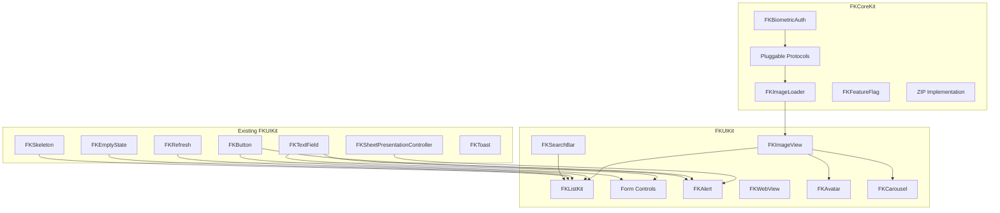

# FKKit Component Integration & Roadmap

Planning document for upcoming FKKit version iterations: new component integration, existing module enhancements, and architectural alignment.

**Status:** Draft (living document on branch `docs/component-roadmap`)  
**Last reviewed against codebase:** `develop` baseline  
**Audience:** Maintainers, contributors, and integrators planning adoption across releases.  
**中文版本:** [COMPONENT_ROADMAP.zh-CN.md](COMPONENT_ROADMAP.zh-CN.md)

---

## Table of Contents

- [Purpose](#purpose)
- [Scope & Constraints](#scope--constraints)
- [Analysis Methodology](#analysis-methodology)
- [Current Capability Inventory](#current-capability-inventory)
- [Gap Summary](#gap-summary)
- [Tier 1 — Highest Priority](#tier-1--highest-priority)
- [Tier 2 — High Value, Next Wave](#tier-2--high-value-next-wave)
- [Tier 3 — Vertical / Lower Frequency](#tier-3--vertical--lower-frequency)
- [Existing Module Enhancements](#existing-module-enhancements)
- [Do Not Duplicate — Reuse Matrix](#do-not-duplicate--reuse-matrix)
- [Cross-Component Dependency Map](#cross-component-dependency-map)
- [Phased Release Plan](#phased-release-plan)
- [Per-Component Delivery Checklist](#per-component-delivery-checklist)
- [Pluggable Contract Alignment](#pluggable-contract-alignment)
- [SwiftUI Bridge Coverage Plan](#swiftui-bridge-coverage-plan)
- [FKKitExamples Requirements](#fkkitexamples-requirements)
- [Risks & Open Questions](#risks--open-questions)
- [Revision History](#revision-history)

---

## Purpose

FKKit already ships production-grade infrastructure (`FKCoreKit`) and a growing UI layer (`FKUIKit`). This roadmap identifies **high-frequency gaps** that block teams from scaffolding a typical business app without reimplementing the same UIKit patterns in every project.

Goals for subsequent releases:

1. **Close protocol-only holes** — especially `FKImageLoading`, where Pluggable defines contracts but the library ships no default implementation.
2. **Form a list-page stack** — Diffable list infrastructure wired to `FKRefresh`, `FKEmptyState`, and `FKSkeleton`.
3. **Complete the form/control surface** — search, segmented controls, toggles, sliders, and styled alerts beyond system `UIAlertController`.
4. **Preserve FKKit principles** — Swift 6, iOS 15+, zero third-party runtime dependencies, English APIs/docs, `Sendable` configs, `@MainActor` UI work, full FKKitExamples coverage per public API.

This document is **planning only**. Implementation order may shift based on community demand, breaking-change budget, and maintainer capacity.

---

## Scope & Constraints

| Constraint | Policy |
|------------|--------|
| **Modules** | New non-UI code → `FKCoreKit`; UI controls → `FKUIKit` (depends on `FKCoreKit`). |
| **Dependencies** | No third-party runtime libraries. System frameworks only. |
| **Language** | Swift 6, strict concurrency (`SWIFT_STRICT_CONCURRENCY=complete` in verify). |
| **Platform** | iOS 15+ (per `Package.swift`). |
| **API style** | `FK` + PascalCase types; `fk_` extension prefix in `FKCoreKit/Extension`; configuration structs + `apply` methods. |
| **Documentation** | English `///` on all public members; component `README.md` with directory map; update root `README.md` index when shipping. |
| **Examples** | Every new public capability demonstrated in `FKKitExamples` (hub + one scenario per major feature). |
| **Tests** | Not required by default unless explicitly requested; CI compile verify is mandatory. |
| **Breaking changes** | Follow semver; document in `CHANGELOG.md`; bump `FKPluggable.contractVersion` when protocol contracts change. |

---

## Analysis Methodology

The gap analysis (June 2026) reviewed:

1. **Source tree** — all top-level folders under `Sources/FKCoreKit/Components/` and `Sources/FKUIKit/Components/`.
2. **Pluggable contracts** — `Sources/FKCoreKit/Components/Pluggable/README.md` and protocol groups without default implementations.
3. **Extension depth** — `UITableView` / `UICollectionView` helpers vs. typical list-app needs (Diffable, pagination, swipe actions).
4. **Examples coverage** — `Examples/FKKitExamples/...` hubs and scenarios vs. public API surface.
5. **Cross-references** — README roadmaps (e.g. `FKNetwork`), placeholder APIs (e.g. ZIP in `FKFileManager`), and SwiftUI `Representable` coverage.
6. **Frequency heuristic** — how often medium/large iOS apps reimplement the same pattern (image loading, lists, search, form controls, alerts, WebView, biometrics).

Components are tiered by **business frequency × FKKit synergy × implementation risk**.

---

## Current Capability Inventory

### FKCoreKit — Shipped & Mature

| Area | Path | Maturity | Notes |
|------|------|----------|-------|
| **Pluggable** | `Components/Pluggable/` | Contracts only | Networking, analytics, storage, session, routing, logging, lifecycle, image loading, list cells, text formatting — **interfaces without bundled production adapters for images, feature flags, remote config**. |
| **Network** | `Components/Network/` | Production | URLSession stack, interceptors, cache, upload/download, token refresh, reachability, deduplication. Roadmap: SSL pinning examples, multipart helpers, retry presets. |
| **Storage** | `Components/Storage/` | Production | UserDefaults, Keychain, file, memory; Codable support. |
| **Logger** | `Components/Logger/` | Production | Structured logging, file persistence, crash monitor. |
| **Permissions** | `Components/Permissions/` | Production | Camera, photos, mic, location, notifications, Bluetooth, calendar, etc.; pre-prompt and settings jump. |
| **Security** | `Components/Security/` | Production | Hash, AES, RSA, HMAC, encoding, secure random, masking. **No LocalAuthentication / biometrics.** |
| **FileManager** | `Components/FileManager/` | Production | Sandbox I/O, breakpoint download/upload, cache utilities. **ZIP API surface exists; execution may return `.zipUnavailable`.** |
| **Async** | `Components/Async/` | Production | Main-thread dispatch, debounce, throttle, task groups, serial/concurrent executors. |
| **BusinessKit** | `Components/BusinessKit/` | Production | Version update, analytics, i18n bridge, lifecycle, deeplink router, alert manager (`UIAlertController`), startup tasks, formatters. |
| **I18n** | `Components/I18n/` | Production | Language manager, observation, MessageFormat. |
| **Extension** | `Components/Extension/` | Production | Foundation / CoreGraphics / UIKit `fk_*` helpers, `FKDeviceInfo`, `FKValueParsing`. List view extensions are minimal (`fk_reloadDataWithoutAnimation` only). |

### FKUIKit — Shipped & Mature

| Component | Path | Maturity | Primary use cases |
|-----------|------|----------|-------------------|
| **ActionSheet** | `Components/ActionSheet/` | Production | Bottom/centered/popover sheets, selection, toggles, validation, SwiftUI modifier, `UIAlertController` migration helpers. |
| **Badge** | `Components/Badge/` | Production | View/bar/tab badge anchoring and animation. |
| **BlurView** | `Components/BlurView/` | Production | View/image blur, SwiftUI adapter, IB support. |
| **Button** | `Components/Button/` | Production | Styles, loading, haptics, accessibility, global style. |
| **Callout** | `Components/Callout/` | Production | Tooltip, popover, menu dropdown, beak layout, SwiftUI bridge. |
| **CornerShadow** | `Components/CornerShadow/` | Production | Rounded rect, border, gradient, shadow paths. |
| **Divider** | `Components/Divider/` | Production | Hairline, dashed, gradient separators. |
| **EmptyState** | `Components/EmptyState/` | Production | Loading/empty/error overlays, layered configuration, slots. |
| **ExpandableText** | `Components/ExpandableText/` | Production | Label/TextView expand-collapse, SwiftUI view. |
| **PagingController** | `Components/PagingController/` | Production | Child VC paging + `FKTabBar` sync, SwiftUI representable. |
| **Player** | `Components/Player/` | Production | Shared playback kernel, video (PiP, subtitles, offline, ads), audio (queue, lyrics, Now Playing). |
| **ProgressBar** | `Components/ProgressBar/` | Production | Linear/ring, buffer, segments, SwiftUI wrapper. |
| **RatingControl** | `Components/RatingControl/` | Production | Interactive/read-only ratings, SwiftUI representable. |
| **Refresh** | `Components/Refresh/` | Production | Pull-to-refresh, load-more, pagination model, SwiftUI bridge. |
| **SheetPresentationController** | `Components/SheetPresentationController/` | Production | Bottom/top/center sheets, anchor dropdowns, detents, keyboard avoidance. |
| **Skeleton** | `Components/Skeleton/` | Production | View/list/container shimmer; avatar preset (not a standalone avatar widget). |
| **TabBar** | `Components/TabBar/` | Production | CollectionView-based tab header, indicator, badges, paging progress. |
| **TextField** | `Components/TextField/` | Production | Formatted input, OTP, counter, validation, SwiftUI representable. |
| **Toast** | `Components/Toast/` | Production | Toast/HUD/snackbar queue, priority, keyboard-aware, SwiftUI hosting. |

### FKUIKit Core

`Sources/FKUIKit/Core/` currently provides appearance primitives (`FKLayerBorderStyle`, `FKLayerShadowStyle`), utilities, and resource/i18n bundles — not a full design-token or theme system.

---

## Gap Summary

Three structural holes account for most day-to-day integration friction:

| Theme | Gap | Impact |
|-------|-----|--------|
| **Images** | `FKImageLoading` protocol exists; no default loader or `FKImageView` | Every feed, profile, and commerce screen reimplements caching and placeholders. |
| **Lists** | Cell protocols exist; no Diffable list controller, section models, or swipe-action helpers | Largest share of UI code in typical apps. |
| **Forms & confirmation** | Strong `FKTextField`; weak surrounding controls (search, segment, toggle, slider) and styled center alerts | Settings, filters, and onboarding flows lack consistent FKKit styling. |

Secondary gaps: WebView, biometrics, inline banners, chips/tags, carousels, pickers, photo picker UI, step indicators, keyboard accessory toolbar, ZIP execution, feature-flag defaults, expanded SwiftUI bridges.

---

## Tier 1 — Highest Priority

### 1.1 FKImageLoader + FKImageView

**Module split**

| Piece | Module | Description |
|-------|--------|-------------|
| `FKImageLoader` | FKCoreKit | Default `FKImageLoading` + optional `FKImageCaching` using URLSession and memory/disk cache. |
| `FKImageView` | FKUIKit | `UIImageView` subclass or composition wrapper with configuration-driven behavior. |

**Problem**

- `Sources/FKCoreKit/Components/Pluggable/Media/FKImageLoading.swift` defines `FKImageLoadRequest`, `FKImageLoading`, and `FKImageCaching` but **no implementation ships in the repo**.
- No reusable view binds loading state to UI (placeholder, progress, failure, retry).

**Proposed public surface (sketch)**

```swift
// FKCoreKit
public final class FKImageLoader: FKImageLoading, FKImageCaching { ... }
public struct FKImageLoaderConfiguration: Sendable { ... } // cache limits, decode policy, timeout

// FKUIKit
public final class FKImageView: UIView { ... }
public struct FKImageViewConfiguration: Sendable { ... } // cornerRadius, border, contentMode, transition
public enum FKImageViewState: Equatable { case idle, loading, success, failure }
```

**Required behavior**

- Async load with cancellation when URL or target size changes.
- Downsampling to target size in points (use existing `UIImage` / `CGSize` extensions where applicable).
- Memory + disk cache with configurable cost/count limits and explicit eviction APIs.
- Placeholder image/color; optional integration with `FKSkeleton` shimmer while loading.
- Failure state with optional tap-to-retry.
- Conformance to `FKImageLoading` so apps can swap implementations at the composition root.
- Accessibility: adjustable image label, loading announced when appropriate.

**Reuse**

- `FKAsync` for coalescing; `FKNetwork` reachability optional hook for offline failure messaging.
- `FKCornerShadow` / `Extension` UIKit helpers for rounding and borders.
- Do **not** depend on third-party image SDKs.

**Examples scenarios**

- Remote URL with placeholder and corner radius.
- List cell reuse and cancellation.
- Failure + retry.
- SwiftUI wrapper (`FKImageViewRepresentable`).


**详细设计需求：** [FKImageLoader-FKImageView_DESIGN.md](FKImageLoader-FKImageView_DESIGN.md) · [中文版](FKImageLoader-FKImageView_DESIGN.zh-CN.md)

---

### 1.2 FKListKit (Diffable List Infrastructure)

**Module:** primarily `FKUIKit`; optional lightweight Diffable snapshot helpers in `FKCoreKit/Extension` if they have no UIKit dependency.

**Problem**

- `FKListTableCellConfigurable` / `FKListCollectionCellConfigurable` (Pluggable) only standardize cell registration/dequeue.
- `UITableView` / `UICollectionView` extensions provide `fk_reloadDataWithoutAnimation()` only — no Diffable Data Source, section abstraction, or pagination wiring.
- Teams repeatedly build the same list VC base: refresh header, empty state, skeleton, load-more footer, error retry.

**Proposed components**

| Type | Responsibility |
|------|----------------|
| `FKListSection` / `FKListItem` | `Hashable` models for Diffable snapshots. |
| `FKDiffableTableViewController` | Base `UIViewController` owning table + data source + optional `FKRefreshControl`. |
| `FKDiffableCollectionViewController` | Compositional layout presets (list, grid, inset list). |
| `FKListCell` presets | Text, subtitle, icon, switch, checkbox, disclosure — styled consistently with `FKButton` / `FKDivider`. |
| `FKListSwipeActionConfiguration` | Wrapper for leading/trailing actions with FK styling hooks. |

**Required behavior**

- Apply snapshot with optional animation; support section headers/footers.
- Lifecycle hooks: `willRefresh`, `didLoadPage`, `didReachEnd` integrated with `FKRefreshPagination`.
- Empty/error overlays via `FKEmptyStateView` (embed or overlay policy documented).
- Initial load skeleton via `FKSkeletonManager` until first successful snapshot apply.
- Pagination reset when pull-to-refresh starts (align with `UIScrollView+FKRefresh` behavior).
- VoiceOver: stable cell identifiers, action labels on swipe actions.

**Reuse**

- `FKRefresh`, `FKEmptyState`, `FKSkeleton`, `FKDivider`, Pluggable cell protocols.
- `FKDebouncer` for search-driven lists (pairs with FKSearchBar).

**Examples scenarios**

- Single-section feed with pull-to-refresh and infinite scroll.
- Multi-section settings-style list with switches.
- Collection grid with empty state.
- Error state with retry button.


**详细设计需求：** [FKListKit_DESIGN.md](FKListKit_DESIGN.md) · [中文版](FKListKit_DESIGN.zh-CN.md)

---

### 1.3 FKSearchBar / FKSearchField

**Module:** `FKUIKit`

**Problem**

Search is ubiquitous (ecommerce, social, utilities). Apps reinvent debounced binding, cancel button, clear button, and focus styling.

**Proposed public surface (sketch)**

```swift
public final class FKSearchBar: UIControl { ... }
public struct FKSearchBarConfiguration: Sendable { ... }
public struct FKSearchBarCallbacks: @unchecked Sendable { ... } // textChanged, submit, cancel, clear
```

**Required behavior**

- Debounced `textChanged` using `FKDebouncer` (configurable interval).
- Optional always-visible cancel button vs. edit-mode cancel.
- Clear button visibility rules.
- Dynamic Type and minimum 44pt touch targets.
- Optional `FKEmptyState` when query returns zero results (host-driven).
- SwiftUI `FKSearchBarRepresentable`.

**Reuse**

- `FKAsync/FKDebouncer`, `FKTextField` decoration patterns where overlap exists (do not merge into TextField — keep search as dedicated control).

**Examples scenarios**

- Live filter with debounce.
- Submit on return key.
- Embedded in navigation bar vs. inline in content.


**Detailed design:** [FKSearchBar-FKSearchField_DESIGN.md](FKSearchBar-FKSearchField_DESIGN.md) · [中文版](FKSearchBar-FKSearchField_DESIGN.zh-CN.md)

---

### 1.4 Form Controls — FKSegmentedControl, FKToggle, FKCheckbox, FKRadioGroup, FKSlider

**Module:** `FKUIKit`

**Problem**

- `FKActionSheet` includes toggle **rows**, not standalone controls.
- `FKTextField` covers text entry but not binary/enum/range input.
- `UISlider` appears inside Player internals only.

**Per-control notes**

| Control | Key features |
|---------|----------------|
| **FKSegmentedControl** | Text and icon segments, badge counts, animated selection indicator (learn from `FKTabBar` indicator), equal/fit width modes, RTL. |
| **FKToggle** | Switch styling aligned with `FKButton` colors; loading/disabled states; accessibility value. |
| **FKCheckbox** | Indeterminate state optional; group semantics for VoiceOver. |
| **FKRadioGroup** | Single selection enforcement; horizontal/vertical layout. |
| **FKSlider** | Single value and range (dual thumb); step snapping; value label; optional haptics (see `FKProgressBar` interaction patterns). |

**Required behavior**

- Configuration structs mirror `FKButton` / `FKRatingControl` layering (appearance, layout, interaction, accessibility).
- UIControl event model for UIKit; SwiftUI representables for each.
- Haptics off by default unless matching product standard (`FKButton`-style).

**Reuse**

- `FKButton` appearance tokens; `FKRatingControl` layout engine patterns for hit testing.

**Examples scenarios**

- Filter bar: segment + slider range.
- Settings form: toggles and radio group.
- Comparison with ActionSheet toggle rows (document when to use which).


**Detailed design:** [FKFormControls_DESIGN.md](FKFormControls_DESIGN.md) · [中文版](FKFormControls_DESIGN.zh-CN.md)

---

### 1.5 FKAlert (Styled Center Confirmation)

**Module:** `FKUIKit`

**Problem**

- `FKBusinessAlertManager` wraps system `UIAlertController` — not customizable, not aligned with FK visual language.
- `FKActionSheet` covers bottom sheets and action-sheet migration, not centered destructive confirmations or alert-style text input.

**Proposed behavior**

- Presentation via `FKSheetPresentationController` `.center` mode (reuse backdrop, keyboard, lifecycle).
- Content: title, message, primary/secondary/destructive buttons, optional text field (rename, feedback).
- Queue and de-duplication policy (port concepts from `FKBusinessAlertManager.presentOnce`).
- Dangerous action styling (destructive button prominence, optional confirmation checkbox).

**Reuse**

- `FKSheetPresentationController`, `FKButton`, `FKTextField` (single-line input variant).
- Do not duplicate ActionSheet row rendering.

**Examples scenarios**

- Delete confirmation (destructive).
- Alert with text field.
- Stacked alerts / de-duplication by ID.


**Detailed design:** [FKAlert_DESIGN.md](FKAlert_DESIGN.md) · [中文版](FKAlert_DESIGN.zh-CN.md)

---

### 1.6 FKWebView

**Module:** `FKUIKit` (wraps `WebKit`)

**Problem**

Hybrid content (terms, payments, OAuth, campaigns) appears in nearly every consumer app. No FKKit wrapper for progress, errors, or navigation chrome.

**Proposed public surface (sketch)**

```swift
public final class FKWebView: UIView { ... }
public struct FKWebViewConfiguration: Sendable { ... }
public protocol FKWebViewDelegate: AnyObject { ... }
public struct FKWebViewNavigationPolicy: Sendable { ... }
```

**Required behavior**

- Loading progress (optional `FKProgressBar` integration).
- Error page with `FKEmptyState` (retry, open in Safari).
- Back/forward/close actions; optional toolbar.
- `WKWebView` configuration injection (user agent, data store, JavaScript enabled flag).
- JavaScript message handler registration (typed bridge).
- External link policy (in-app vs. `UIApplication.shared.open`).
- Cookie/auth header injection documented for integrators (security-sensitive — no logging of secrets).

**Reuse**

- `FKEmptyState`, `FKProgressBar`, `FKButton`, `FKNetwork` reachability for offline messaging.

**Examples scenarios**

- Load remote URL with progress bar.
- OAuth-style redirect handling (mock URL).
- JavaScript bridge echo.
- Error and retry.


**Detailed design:** [FKWebView_DESIGN.md](FKWebView_DESIGN.md) · [中文版](FKWebView_DESIGN.zh-CN.md)

---

### 1.7 FKBiometricAuth

**Module:** `FKCoreKit` (uses `LocalAuthentication`)

**Problem**

`FKSecurity` covers cryptography but not device-owner authentication. Finance and account apps need a unified Face ID / Touch ID / passcode fallback story.

**Proposed public surface (sketch)**

```swift
public struct FKBiometricCapability: Sendable { ... } // available, biometryType, enrolled
public enum FKBiometricPolicy: Sendable { ... }
public protocol FKBiometricAuthenticating: Sendable { ... }
public final class FKBiometricAuth: FKBiometricAuthenticating { ... }
```

**Required behavior**

- Capability probe without triggering UI.
- `async` authenticate with localized reason string (integrator-provided; library provides fallback keys in `FKI18n` bundle if needed).
- Error taxonomy mapped to `FKBiometricError` (cancel, lockout, not enrolled, etc.).
- Optional pairing guide with `FKKeychain` / `Storage` for unlocking tokens after success.
- No storage of biometrics — authentication only.

**Examples scenarios**

- Check capability.
- Successful auth flow.
- User cancel and lockout handling.


**Detailed design:** [FKBiometricAuth_DESIGN.md](FKBiometricAuth_DESIGN.md) · [中文版](FKBiometricAuth_DESIGN.zh-CN.md)

---

## Tier 2 — High Value, Next Wave

### 2.1 FKBanner / FKNoticeBar

**Difference from Toast:** persistent inline strip at top/bottom of content; supports action button and swipe-to-dismiss; does not use global toast queue.

| Aspect | Detail |
|--------|--------|
| **Use cases** | App upgrade nudge, offline mode, account verification, maintenance notice. |
| **Integration** | Optional safe-area inset adjustment; stack multiple banners with priority. |
| **Reuse** | `FKButton`, `CornerShadow`, `FKUIKitI18n`. |

### 2.2 FKChip / FKTag

Selectable and read-only chips for filters and metadata. Support leading icon, remove button, max selection in groups.


**Detailed design:** [FKSmallComponents_DESIGN.md](FKSmallComponents_DESIGN.md) §9–11 · [中文版](FKSmallComponents_DESIGN.zh-CN.md)

### 2.3 FKAvatar

Circular/squircle avatar with placeholder initials, optional online badge (`FKBadge`), loading via `FKImageView`, tap handler.


**Detailed design:** [FKSmallComponents_DESIGN.md](FKSmallComponents_DESIGN.md) §7–8 · [中文版](FKSmallComponents_DESIGN.zh-CN.md)

### 2.4 FKCarousel / FKImageBanner

Horizontal paging carousel with page indicator, auto-scroll policy, infinite loop option, `FKImageView` for pages.


**Detailed design:** [FKCarousel-FKImageBanner_DESIGN.md](FKCarousel-FKImageBanner_DESIGN.md) · [中文版](FKCarousel-FKImageBanner_DESIGN.zh-CN.md)

### 2.5 FKDatePicker / FKPicker

| Component | Notes |
|-----------|-------|
| **FKDatePicker** | Wheel/calendar/compact styles; date, time, date+time; min/max range; locale/time zone from `FKI18n`. Present via sheet. |
| **FKPicker** | Single/multi column; toolbar Done/Cancel; bridge to `FKSheetPresentationController`. |


### 2.6 FKPhotoPicker

UIImagePickerController / PHPicker wrapper with `FKPermissions` preflight, selection limit, compression options, callback with `UIImage` or file URL.


**Detailed design:** [FKPhotoPicker_DESIGN.md](FKPhotoPicker_DESIGN.md) · [中文版](FKPhotoPicker_DESIGN.zh-CN.md)

### 2.7 FKStepIndicator / FKTimeline

Horizontal step progress (checkout) and vertical timeline (logistics, audit). Support completed/current/upcoming states and custom icons.


**Detailed design:** [FKStepIndicator-FKTimeline_DESIGN.md](FKStepIndicator-FKTimeline_DESIGN.md) · [中文版](FKStepIndicator-FKTimeline_DESIGN.zh-CN.md)

### 2.8 FKKeyboardToolbar

`inputAccessoryView` toolbar: previous/next field, Done; pairs with `FKTextFieldManager` or new `FKFormFocusCoordinator`.


### 2.9 ZIP — Complete FileManager Implementation

Replace placeholder ZIP path in `FKFileStorageCore` with native implementation (Archive.framework on supported OS versions or documented fallback).


### 2.10 FKFeatureFlag — Default Adapters

Memory-backed `FKFeatureFlagProviding` for tests and small apps; optional remote adapter sketch conforming to Pluggable (host supplies endpoint).


### 2.11 SwiftUI Bridge Expansion

See [SwiftUI Bridge Coverage Plan](#swiftui-bridge-coverage-plan).

---

## Tier 3 — Vertical / Lower Frequency

| Component | Module | Notes |
|-----------|--------|-------|
| **FKQRCode** | FKCoreKit + FKUIKit | Generation (`CIFilter`) + scanner UI (`AVFoundation`) with camera permission via `FKPermissions`. |
| **FKMarquee** | FKUIKit | Scrolling label for announcements; respect Reduced Motion. |
| **FKAccordion** | FKUIKit | Collapsible sections for FAQ/settings; single/multiple expansion. |
| **FKShareSheet** | FKUIKit | Unified share presenter over `UIActivityViewController` + `FKFileManager` share helpers. |
| **FKTheme** | FKUIKit Core | Design tokens: color roles, typography scales, spacing; dark mode and Dynamic Type. |
| **FKForm** | FKUIKit | Form-level validation orchestration atop `FKTextField` (cross-field rules, submit gating). |
| **FKLocalNotificationManager** | FKCoreKit | Schedule/cancel local notifications atop `UserNotifications` (permission via `FKPermissions`). |

---

## Existing Module Enhancements

Enhancements that are not new components but should ride version trains:

### FKNetwork (`FKCoreKit`)

Per `Components/Network/README.md` roadmap:

- Stricter SSL pinning examples and documentation.
- Multipart upload helper utilities (boundary builder, file parts).
- Retry policy presets (exponential backoff, idempotent methods only).
- Mock `URLSession` templates for integrator test harnesses (documentation + sample code, not necessarily shipped test targets).

### FKFileManager (`FKCoreKit`)

- Ship working ZIP compress/decompress or clearly gate API availability by OS capability.
- Document background transfer limitations and recovery flows.

### FKBusinessKit (`FKCoreKit`)

- Migrate alert presentation to `FKAlert` once available (deprecate direct `UIAlertController` in manager behind configuration flag).
- Expose `FKTopViewControllerResolver` as public API or move to `Extension/UIKit/UIViewController` if broadly needed.

### FKExtension (`FKCoreKit`)

- Expand `UITableView` / `UICollectionView` with Diffable convenience if not entirely subsumed by FKListKit.
- Consider `fk_register` / `fk_dequeue` helpers already partially present on Pluggable extensions — document single entry point.

### Pluggable (`FKCoreKit`)

- When `FKImageLoader` ships, document it as the reference `FKImageLoading` implementation.
- Increment `FKPluggable.contractVersion` only on breaking protocol changes.

### Player / Sheet / TextField (maintenance)

- Continue SwiftUI bridge parity.
- Keep HIG compliance audits (touch targets, VoiceOver) on each release.

---

## Do Not Duplicate — Reuse Matrix

Before starting a new component, check existing coverage:

| User need | Use instead of rebuilding |
|-----------|---------------------------|
| Bottom action menu | `FKActionSheet` (+ `FKActionSheet+AlertMigration`) |
| Anchor dropdown / tooltip | `FKCallout`, `FKSheetPresentationController` anchor mode |
| Brief floating message | `FKToast` |
| Loading placeholder | `FKSkeleton` |
| Pull-to-refresh / load more | `FKRefresh` + `FKRefreshPagination` |
| Empty / error / loading overlay | `FKEmptyState` |
| Tab + swipe paging | `FKTabBar` + `FKPagingController` |
| Formatted text input | `FKTextField`, `FKCodeTextField`, `FKCountTextView` |
| Modal / sheet / detent | `FKSheetPresentationController` |
| System permission prompts | `FKPermissions` |
| HTTP / cache / upload | `FKNetwork`, `FKFileManager` |
| Crypto / signing | `FKSecurity` |
| Debounce / main thread | `FKAsync` |
| Hairline separator | `FKDivider` |
| Long text truncation | `FKExpandableText` |

---

## Cross-Component Dependency Map



**Suggested build order (dependency-respecting):**

1. `FKImageLoader` → `FKImageView`
2. `FKListKit` (parallel after ImageView stable)
3. `FKSearchBar` + form controls (can parallelize)
4. `FKAlert` (after Sheet patterns stable)
5. `FKWebView` + `FKBiometricAuth`
6. Tier 2 dependents (`FKAvatar`, `FKCarousel`, …)

---

## Phased Release Plan

| Phase | Deliverables | Theme |
|-------|--------------|-------|
| **A** | `FKImageLoader`, `FKImageView`, Examples, READMEs | Close image gap |
| **B** | `FKListKit` (table), `FKSearchBar`, Examples | List page MVP |
| **C** | `FKListKit` (collection), `FKSegmentedControl`, `FKToggle` | Lists + basic form controls |
| **D** | `FKCheckbox`, `FKRadioGroup`, `FKSlider`, `FKAlert` | Form + confirmation |
| **E** | `FKWebView`, `FKBiometricAuth` | Hybrid + security auth |
| **F** | `FKBanner`, `FKChip`, ZIP completion | Notices + core fix |
| **G** | `FKAvatar`, `FKCarousel`, `FKFeatureFlag` defaults | Rich media UI |
| **H** | `FKDatePicker`, `FKPicker`, `FKPhotoPicker` | Pickers |
| **I** | `FKStepIndicator`, `FKTimeline`, `FKKeyboardToolbar` | Flows + forms |
| **J** | Tier 3 vertical components, `FKTheme`, `FKForm` | Polish & specialization |

Each phase should:

1. Land on branch → PR to `develop`.
2. Pass `xcodebuild` verify (`SWIFT_STRICT_CONCURRENCY=complete`).
3. Update `CHANGELOG.md` under `[Unreleased]`.
4. Update root `README.md` component index when public API ships.
5. Add FKKitExamples hub + scenarios (`/fkkitexamples` skill).

---

## Per-Component Delivery Checklist

Copy for every new component PR:

- [ ] Module placement correct (`FKCoreKit` vs `FKUIKit`)
- [ ] Directory layout documented in component `README.md` (folder → responsibility table)
- [ ] All public types have English `///` doc comments
- [ ] Configuration structs are `Sendable` / `Equatable` where appropriate
- [ ] UI types marked `@MainActor` where touching UIKit
- [ ] Reused existing `FKCoreKit` Extension/Utils/Pluggable APIs (no duplicated helpers)
- [ ] Edge cases: empty input, cancellation, reuse, Dynamic Type, Dark Mode, VoiceOver
- [ ] `Package.swift` `exclude:` updated for new README paths
- [ ] FKKitExamples: hub entry + one scenario per major capability
- [ ] Root `README.md` index row added
- [ ] `xcodebuild -scheme FKKit-Package` **BUILD SUCCEEDED**
- [ ] `CHANGELOG.md` entry under `[Unreleased]`
- [ ] No third-party dependencies introduced

---

## Pluggable Contract Alignment

| Protocol group | Current state | Roadmap action |
|----------------|---------------|----------------|
| `FKImageLoading` / `FKImageCaching` | Protocol only | Ship `FKImageLoader` as reference impl; document injection at app launch |
| `FKListTableCellConfigurable` / `FKListCollectionCellConfigurable` | Protocol + registration helpers | FKListKit cells should conform; add example cells in Examples |
| `FKTextFormatting` / `FKTextValidating` | Protocol only | FKForm (Tier 3) may supply shared validators; TextField already implements local validation |
| `FKFeatureFlagProviding` / `FKRemoteConfigProviding` | Protocol only | Tier 2 memory + remote adapter |
| `FKNetworkReachabilityProviding` | Implemented in Network tool | Expose bridge for `FKImageView` / `FKWebView` offline UI |
| `FKPluggableAnalyticsTracking` | BusinessKit + examples | No change required for UI roadmap |

When adding default implementations, **do not** force apps to use them — keep protocol injection as the primary integration story for medium/large apps.

---

## SwiftUI Bridge Coverage Plan

### Already shipped (representable / bridge)

- `FKSwiftUIBlurView`, `FKActionSheetModifier`, `FKCalloutSwiftUIBridge`, `FKExpandableTextView`, `FKPagingControllerRepresentable`, `FKProgressBarSwiftUIView`, `FKRatingControlRepresentable`, `FKRefreshSwiftUIBridge`, `FKTabBarRepresentable`, `FKTextFieldRepresentable`, `FKAudioPlayerSwiftUIView`, `FKVideoPlayerSwiftUIView`, Toast hosting APIs.

### Priority bridges for new work

| Component | Bridge name (proposed) | Priority |
|-----------|------------------------|----------|
| FKImageView | `FKImageViewRepresentable` | P0 (with ImageView) |
| FKSearchBar | `FKSearchBarRepresentable` | P1 |
| FKAlert | `FKAlertModifier` / binding API | P1 |
| Form controls | Per-control `Representable` | P1 |
| FKListKit | Host wrapper or cell content builders | P2 |

### Backfill existing UIKit-only components

| Component | Priority |
|-----------|----------|
| `FKButton` | P1 |
| `FKEmptyState` | P1 |
| `FKBadge` | P2 |
| `FKSkeleton` | P2 |
| `FKDivider` | P3 |

SwiftUI bridges should be thin; business logic stays in UIKit types.

---

## FKKitExamples Requirements

For each roadmap component, Examples must include:

| Scenario type | Requirement |
|---------------|-------------|
| **Hub** | Entry in module hub list with short English subtitle |
| **Basics** | Default configuration happy path |
| **Configuration** | At least one variant (style, layout, or behavior) |
| **Edge case** | Empty, error, disabled, or cancellation where applicable |
| **Integration** | Cross-component scenario where relevant (e.g. List + Refresh + EmptyState + ImageView) |

Mirror directory layout: `Examples/FKKitExamples/.../FKUIKit/<Component>/`.

---

## Risks & Open Questions

| ID | Topic | Question / risk | Mitigation |
|----|-------|-----------------|------------|
| R1 | **Scope creep** | FKListKit can balloon into a full app framework. | Ship minimal Diffable base first; presets incremental. |
| R2 | **ZIP support** | Archive.framework availability vs. pure Swift fallback. | Feature-detect; document `.zipUnavailable` until complete. |
| R3 | **WebView security** | JS bridge and cookie injection are footgun-prone. | Strict docs, opt-in handlers, no secret logging. |
| R4 | **Biometrics UX** | Lockout and fallback vary by iOS version. | Map errors explicitly; test on device simulators. |
| R5 | **SwiftUI parity** | Maintaining dual bridges doubles API surface. | Thin representables; shared configuration structs. |
| R6 | **Overlap with ActionSheet** | Alert vs ActionSheet vs Toast boundaries blur. | Document decision tree in README (see reuse matrix). |
| R7 | **Binary size** | Many components increase compile time and app size. | Keep modules in one product but document optional integration patterns. |

**Open decisions for maintainers**

1. Should `FKListKit` live as one folder or split `List/` + `ListCells/`?
2. Should `FKImageLoader` disk cache use `FKStorage` file backend or dedicated cache directory?
3. Should `FKAlert` replace `FKBusinessAlertManager` implementation or coexist indefinitely?
4. Minimum SwiftUI backfill before a major marketing release?

---

## Revision History

| Date | Branch | Change |
|------|--------|--------|
| 2026-06-08 | `docs/component-roadmap` | Initial roadmap from codebase gap analysis (`develop` baseline). |
| 2026-06-08 | `docs/component-roadmap` | Added Chinese edition `COMPONENT_ROADMAP.zh-CN.md`. |

---

## Related Documents

- [RELEASING.md](RELEASING.md) — version bump and tag checklist
- [EXTENSION_VS_UTILS.md](EXTENSION_VS_UTILS.md) — Extension layout policy
- [Root README.md](../README.md) — shipped component index
- [Pluggable README](../Sources/FKCoreKit/Components/Pluggable/README.md) — DI contracts
- [Network README](../Sources/FKCoreKit/Components/Network/README.md) — network roadmap items
