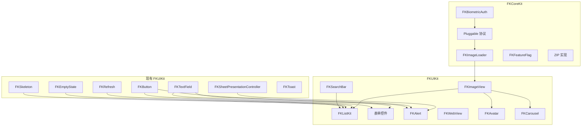

# FKKit 组件集成与迭代路线图

面向 FKKit 后续版本迭代的规划文档：新组件集成、现有模块改造与架构对齐。

**状态：** 草案（活文档，分支 `docs/component-roadmap`）  
**代码库审阅基准：** `develop` 基线  
**读者：** 维护者、贡献者，以及规划跨版本接入的集成方。  

---

## 目录

- [目的](#目的)
- [范围与约束](#范围与约束)
- [组件源码目录规范](#组件源码目录规范)
- [分析方法](#分析方法)
- [现有能力清单](#现有能力清单)
- [缺口摘要](#缺口摘要)
- [Tier 1 — 最高优先级](#tier-1--最高优先级)
- [Tier 2 — 高价值，第二波](#tier-2--高价值第二波)
- [Tier 3 — 垂直场景 / 较低频率](#tier-3--垂直场景--较低频率)
- [现有模块增强项](#现有模块增强项)
- [勿重复造轮子 — 复用对照表](#勿重复造轮子--复用对照表)
- [跨组件依赖关系图](#跨组件依赖关系图)
- [分阶段发布计划](#分阶段发布计划)
- [单组件交付检查清单](#单组件交付检查清单)
- [Pluggable 契约对齐](#pluggable-契约对齐)
- [SwiftUI Bridge 覆盖计划](#swiftui-bridge-覆盖计划)
- [FKKitExamples 要求](#fkkitexamples-要求)
- [风险与待决问题](#风险与待决问题)
- [修订历史](#修订历史)

---

## 目的

FKKit 已具备生产级基础设施（`FKCoreKit`）和持续扩展的 UI 层（`FKUIKit`）。本路线图识别**高频缺口**——那些导致团队在几乎每个项目中都要重复实现相同 UIKit 模式的环节，从而阻碍「用 FKKit 快速搭起典型业务 App」的目标。

后续版本的目标：

1. **补齐「仅有协议、无实现」的空洞** — 尤其是 `FKImageLoading`：Pluggable 已定义契约，但库内未提供默认实现。
2. **形成列表页技术栈** — Diffable 列表基础设施，并与 `FKRefresh`、`FKEmptyState`、`FKSkeleton` 打通。
3. **完善表单/控件面** — 搜索、分段控件、开关、滑块，以及超越系统 `UIAlertController` 的自定义居中 Alert。
4. **坚守 FKKit 原则** — Swift 6、iOS 15+、零第三方运行时依赖、英文 API/文档、`Sendable` 配置、`@MainActor` UI 工作、每个公开 API 均有完整 FKKitExamples 覆盖。

本文档**仅作规划**。实施顺序可能随社区需求、破坏性变更预算和维护者精力而调整。

---

## 范围与约束

| 约束项 | 政策 |
|--------|------|
| **模块划分** | 非 UI 新代码 → `FKCoreKit`；UI 控件 → `FKUIKit`（依赖 `FKCoreKit`）。 |
| **依赖** | 禁止第三方运行时库，仅使用系统框架。 |
| **语言** | Swift 6，严格并发（verify 时 `SWIFT_STRICT_CONCURRENCY=complete`）。 |
| **平台** | iOS 15+（以 `Package.swift` 为准）。 |
| **API 风格** | 类型名 `FK` + PascalCase；`FKCoreKit/Extension` 扩展使用 `fk_` 前缀；配置结构体 + `apply` 方法。 |
| **文档** | 所有公开成员英文 `///`；组件 `README.md` 含目录结构说明；发版时更新根 `README.md` 索引。 |
| **Examples** | 每个新公开能力在 `FKKitExamples` 中演示（Hub + 每个主要特性至少一个场景）。 |
| **测试** | 默认不要求，除非明确请求；CI 编译验证为必选项。 |
| **破坏性变更** | 遵循 semver；记入 `CHANGELOG.md`；协议契约变更时递增 `FKPluggable.contractVersion`。 |

---

## 组件源码目录规范

`docs/` 下的组件设计文档（例如 `FKImageLoader-FKImageView_DESIGN.zh-CN.md`）会给出**建议的**源码目录树——常见为 `Public/`、`Internal/`、`Extension/` 等分层。这些树用于说明一种合理的组织方式，属于**建议架构**，**不是**必须严格遵守的模板。

实际封装组件与模块时：

1. **灵活调整目录**，按组件复杂度与领域选型：小组件可用更扁平的结构；大模块可按特性、层次或 API 区域分组（参考 `Button`、`Refresh`、`Pluggable/` 等已有组件，而非机械复制设计文档）。
2. **不必强制**使用 `Public/` / `Internal/` / `Extension/`；仅在能提升可读性时使用。FKKit 不对所有组件统一规定单一目录 scheme。
3. **必须在**组件 `README.md` 中**文档化**最终采用的目录（文件夹 → 职责表或树形说明）。该 README 才是对接入方的规范说明。
4. **保持可发现性**：公开 API 易于定位；实现细节保持非公开（`internal` / `private`）。
5. **符合 FKKit 质量要求**：公开成员英文 `///`、`Sendable`/`Equatable` 配置、`@MainActor` UI、复用已有 `FKCoreKit` / `FKUIKit` 能力、`Sources/` 下 README 纳入 `Package.swift` `exclude:`。

[各组件交付检查清单](#各组件交付检查清单) 中「组件 README 记录目录布局」为**可验收项**——不要求与设计文档中的目录树逐字一致。

---

## 分析方法

缺口分析（2026 年 6 月）审阅了：

1. **源码树** — `Sources/FKCoreKit/Components/` 与 `Sources/FKUIKit/Components/` 下所有顶层目录。
2. **Pluggable 契约** — `Sources/FKCoreKit/Components/Pluggable/README.md` 及无默认实现的协议组。
3. **Extension 深度** — `UITableView` / `UICollectionView` 辅助方法与典型列表 App 需求（Diffable、分页、滑动操作）的差距。
4. **Examples 覆盖** — `Examples/FKKitExamples/...` 的 Hub/场景 vs 公开 API 面。
5. **交叉引用** — 各 README 路线图（如 `FKNetwork`）、占位 API（如 `FKFileManager` 的 ZIP）、SwiftUI `Representable` 覆盖情况。
6. **频率启发式** — 中大型 iOS App 重复实现同一模式的常见程度（图片加载、列表、搜索、表单控件、Alert、WebView、生物识别等）。

组件按 **业务频率 × 与 FKKit 协同度 × 实现风险** 分级。

---

## 现有能力清单

### FKCoreKit — 已交付且成熟

| 领域 | 路径 | 成熟度 | 说明 |
|------|------|--------|------|
| **Pluggable** | `Components/Pluggable/` | 仅契约 | 网络、埋点、存储、会话、路由、日志、生命周期、图片加载、列表 Cell、文本格式化 — **图片、Feature Flag、远程配置等无内置生产级适配器**。 |
| **Network** | `Components/Network/` | 生产可用 | URLSession 栈、拦截器、缓存、上传下载、Token 刷新、可达性、去重。路线图：SSL Pinning 示例、Multipart 辅助、重试预设。 |
| **Storage** | `Components/Storage/` | 生产可用 | UserDefaults、Keychain、文件、内存；Codable 支持。 |
| **Logger** | `Components/Logger/` | 生产可用 | 结构化日志、文件持久化、崩溃监控。 |
| **Permissions** | `Components/Permissions/` | 生产可用 | 相机、相册、麦克风、定位、通知、蓝牙、日历等；预提示与跳转设置。 |
| **Security** | `Components/Security/` | 生产可用 | 哈希、AES、RSA、HMAC、编码、安全随机、脱敏。**无 LocalAuthentication / 生物识别。** |
| **FileManager** | `Components/FileManager/` | 生产可用 | 沙盒 I/O、断点下载上传、缓存工具。**ZIP API 已暴露；执行可能返回 `.zipUnavailable`。** |
| **Async** | `Components/Async/` | 生产可用 | 主线程调度、防抖、节流、任务组、串行/并发执行器。 |
| **BusinessKit** | `Components/BusinessKit/` | 生产可用 | 版本更新、埋点、i18n 桥接、生命周期、DeepLink 路由、Alert 管理器（`UIAlertController`）、启动任务、格式化工具。 |
| **I18n** | `Components/I18n/` | 生产可用 | 语言管理、观察、MessageFormat。 |
| **Extension** | `Components/Extension/` | 生产可用 | Foundation / CoreGraphics / UIKit `fk_*` 辅助、`FKDeviceInfo`、`FKValueParsing`。列表视图扩展较薄（仅 `fk_reloadDataWithoutAnimation`）。 |

### FKUIKit — 已交付且成熟

| 组件 | 路径 | 成熟度 | 主要场景 |
|------|------|--------|----------|
| **ActionSheet** | `Components/ActionSheet/` | 生产可用 | 底部/居中/Popover 操作表、选择、开关行、校验、SwiftUI Modifier、`UIAlertController` 迁移辅助。 |
| **Badge** | `Components/Badge/` | 生产可用 | 视图/Bar/Tab 角标锚定与动画。 |
| **BlurView** | `Components/BlurView/` | 生产可用 | 视图/图片模糊、SwiftUI 适配、IB 支持。 |
| **Button** | `Components/Button/` | 生产可用 | 样式、加载态、触觉反馈、无障碍、全局样式。 |
| **Callout** | `Components/Callout/` | 生产可用 | 工具提示、Popover、菜单下拉、尖角布局、SwiftUI 桥接。 |
| **CornerShadow** | `Components/CornerShadow/` | 生产可用 | 圆角矩形、边框、渐变、阴影路径。 |
| **Divider** | `Components/Divider/` | 生产可用 | 发丝线、虚线、渐变分隔线。 |
| **EmptyState** | `Components/EmptyState/` | 生产可用 | 加载/空态/错误叠加层、分层配置、插槽。 |
| **ExpandableText** | `Components/ExpandableText/` | 生产可用 | Label/TextView 展开收起、SwiftUI 视图。 |
| **PagingController** | `Components/PagingController/` | 生产可用 | 子 VC 分页 + `FKTabBar` 同步、SwiftUI Representable。 |
| **Player** | `Components/Player/` | 生产可用 | 共享播放内核；视频（PiP、字幕、离线、广告）；音频（队列、歌词、Now Playing）。 |
| **ProgressBar** | `Components/ProgressBar/` | 生产可用 | 线性/环形、缓冲、分段、SwiftUI 封装。 |
| **RatingControl** | `Components/RatingControl/` | 生产可用 | 交互/只读评分、SwiftUI Representable。 |
| **Refresh** | `Components/Refresh/` | 生产可用 | 下拉刷新、加载更多、分页模型、SwiftUI 桥接。 |
| **SheetPresentationController** | `Components/SheetPresentationController/` | 生产可用 | 底部/顶部/居中 Sheet、锚点下拉、Detent、键盘避让。 |
| **Skeleton** | `Components/Skeleton/` | 生产可用 | 视图/列表/容器骨架屏；含头像预设（非独立头像组件）。 |
| **TabBar** | `Components/TabBar/` | 生产可用 | 基于 CollectionView 的 Tab 头、指示器、角标、分页进度联动。 |
| **TextField** | `Components/TextField/` | 生产可用 | 格式化输入、OTP、计数、校验、SwiftUI Representable。 |
| **Toast** | `Components/Toast/` | 生产可用 | Toast/HUD/Snackbar 队列、优先级、键盘感知、SwiftUI 承载。 |

### FKUIKit Core

`Sources/FKUIKit/Core/` 目前提供外观原语（`FKLayerBorderStyle`、`FKLayerShadowStyle`）、工具类及资源/i18n 包 — **尚未形成完整的设计令牌或主题系统**。

---

## 缺口摘要

日常集成摩擦主要来自三个结构性空洞：

| 主题 | 缺口 | 影响 |
|------|------|------|
| **图片** | `FKImageLoading` 协议存在；无默认 Loader 与 `FKImageView` | 信息流、个人页、电商页均需重复实现缓存与占位。 |
| **列表** | Cell 协议存在；无 Diffable 列表 Controller、Section 模型、滑动操作封装 | 典型 App 中占比最大的 UI 代码量。 |
| **表单与确认** | `FKTextField` 较强；周边控件（搜索、分段、开关、滑块）与自定义居中 Alert 较弱 | 设置、筛选、引导流缺乏统一 FKKit 视觉语言。 |

次要缺口：WebView、生物识别、内嵌横幅、Chip/标签、轮播、选择器、相册选择 UI、步骤条、键盘 accessory 工具栏、ZIP 真正实现、Feature Flag 默认适配、SwiftUI Bridge 扩展等。

---

## Tier 1 — 最高优先级

### 1.1 FKImageLoader + FKImageView

**模块划分**

| 部件 | 模块 | 说明 |
|------|------|------|
| `FKImageLoader` | FKCoreKit | 基于 URLSession 与内存/磁盘缓存的默认 `FKImageLoading` + 可选 `FKImageCaching` 实现。 |
| `FKImageView` | FKUIKit | `UIImageView` 子类或组合封装，行为由配置驱动。 |

**问题**

- `Sources/FKCoreKit/Components/Pluggable/Media/FKImageLoading.swift` 定义了 `FKImageLoadRequest`、`FKImageLoading`、`FKImageCaching`，但**仓库内无实现**。
- 无可复用视图将加载状态绑定到 UI（占位、进度、失败、重试）。

**拟议公开 API（草案）**

```swift
// FKCoreKit
public final class FKImageLoader: FKImageLoading, FKImageCaching { ... }
public struct FKImageLoaderConfiguration: Sendable { ... } // cache limits, decode policy, timeout

// FKUIKit
public final class FKImageView: UIView { ... }
public struct FKImageViewConfiguration: Sendable { ... } // cornerRadius, border, contentMode, transition
public enum FKImageViewState: Equatable { case idle, loading, success, failure }
```

**必需行为**

- 异步加载；URL 或目标尺寸变化时取消进行中的请求。
- 按目标点尺寸降采样（复用现有 `UIImage` / `CGSize` 扩展）。
- 内存 + 磁盘缓存，可配置成本/数量上限，提供显式淘汰 API。
- 占位图/占位色；加载中可选与 `FKSkeleton` 闪烁联动。
- 失败态，可选点击重试。
- 遵循 `FKImageLoading`，便于在组合根替换实现。
- 无障碍：可调图片标签，适当时播报加载状态。

**复用**

- `FKAsync` 合并请求；`FKNetwork` 可达性可选用于离线失败提示。
- `FKCornerShadow` / `Extension` UIKit 辅助处理圆角与边框。
- **禁止**依赖第三方图片 SDK。

**Examples 场景**

- 远程 URL + 占位 + 圆角。
- 列表 Cell 复用与取消。
- 失败 + 重试。
- SwiftUI 封装（`FKImageViewRepresentable`）。


**详细设计需求：** [FKImageLoader-FKImageView_DESIGN.zh-CN.md](FKImageLoader-FKImageView_DESIGN.zh-CN.md)

---

### 1.2 FKListKit（Diffable 列表基础设施）

**模块：** 主要在 `FKUIKit`；若无 UIKit 依赖，可在 `FKCoreKit/Extension` 提供轻量 Diffable 快照辅助。

**问题**

- `FKListTableCellConfigurable` / `FKListCollectionCellConfigurable`（Pluggable）仅规范 Cell 注册/出队。
- `UITableView` / `UICollectionView` 扩展仅有 `fk_reloadDataWithoutAnimation()` — 无 Diffable Data Source、Section 抽象、分页接线。
- 团队反复搭建相同列表 VC 基类：刷新头、空态、骨架屏、加载更多脚、错误重试。

**拟议组件**

| 类型 | 职责 |
|------|------|
| `FKListSection` / `FKListItem` | Diffable 快照用的 `Hashable` 模型。 |
| `FKDiffableTableViewController` | 持有 Table + DataSource + 可选 `FKRefreshControl` 的基类 VC。 |
| `FKDiffableCollectionViewController` | Compositional Layout 预设（列表、网格、内嵌列表）。 |
| `FKListCell` 预设 | 纯文本、副标题、图标、开关、复选、箭头 — 与 `FKButton` / `FKDivider` 风格一致。 |
| `FKListSwipeActionConfiguration` | 左/右滑操作封装，预留 FK 样式钩子。 |

**必需行为**

- 应用快照（可选动画）；支持 Section 头/尾。
- 生命周期钩子：`willRefresh`、`didLoadPage`、`didReachEnd`，与 `FKRefreshPagination` 集成。
- 通过 `FKEmptyStateView` 展示空态/错误（内嵌或叠加策略需在文档中说明）。
- 首次加载用 `FKSkeletonManager` 骨架，直至首次成功 apply 快照。
- 下拉刷新开始时重置分页（与 `UIScrollView+FKRefresh` 行为对齐）。
- VoiceOver：稳定 Cell 标识、滑动操作可读标签。

**复用**

- `FKRefresh`、`FKEmptyState`、`FKSkeleton`、`FKDivider`、Pluggable Cell 协议。
- `FKDebouncer` 用于搜索驱动列表（与 FKSearchBar 配对）。

**Examples 场景**

- 单 Section 信息流：下拉刷新 + 无限滚动。
- 多 Section 设置风列表 + 开关。
- Collection 网格 + 空态。
- 错误态 + 重试按钮。


**详细设计需求：** [FKListKit_DESIGN.zh-CN.md](FKListKit_DESIGN.zh-CN.md)

---

### 1.3 FKSearchBar / FKSearchField

**模块：** `FKUIKit`

**问题**

搜索 ubiquitous（电商、社交、工具类）。各 App 重复实现防抖绑定、取消按钮、清除按钮、焦点样式。

**拟议公开 API（草案）**

```swift
public final class FKSearchBar: UIControl { ... }
public struct FKSearchBarConfiguration: Sendable { ... }
public struct FKSearchBarCallbacks: @unchecked Sendable { ... } // textChanged, submit, cancel, clear
```

**必需行为**

- 使用 `FKDebouncer` 的防抖 `textChanged`（间隔可配置）。
- 取消按钮：常显 vs 编辑态显示。
- 清除按钮显示规则。
- Dynamic Type 与最小 44pt 触控目标。
- 零结果时可选 `FKEmptyState`（由宿主驱动）。
- SwiftUI `FKSearchBarRepresentable`。

**复用**

- `FKAsync/FKDebouncer`；与 `FKTextField` 装饰模式重叠处可借鉴（**不要**并入 TextField — 搜索保持独立控件）。

**Examples 场景**

- 实时筛选 + 防抖。
- 回车提交。
- 嵌入导航栏 vs 内容区行内。


**详细设计需求：** [FKSearchBar-FKSearchField_DESIGN.zh-CN.md](FKSearchBar-FKSearchField_DESIGN.zh-CN.md)

---

### 1.4 表单控件 — FKSegmentedControl、FKToggle、FKCheckbox、FKRadioGroup、FKSlider

**模块：** `FKUIKit`

**问题**

- `FKActionSheet` 含 Toggle **行**，非独立控件。
- `FKTextField` 覆盖文本输入，不覆盖二元/枚举/区间输入。
- `UISlider` 仅出现在 Player 内部。

**各控件要点**

| 控件 | 关键特性 |
|------|----------|
| **FKSegmentedControl** | 文本/图标分段、角标数量、动画选中指示器（参考 `FKTabBar`）、等宽/自适应宽度、RTL。 |
| **FKToggle** | 与 `FKButton` 配色一致的开关样式；加载/禁用态；无障碍 value。 |
| **FKCheckbox** | 可选半选态；VoiceOver 组语义。 |
| **FKRadioGroup** | 强制单选；水平/垂直布局。 |
| **FKSlider** | 单值与区间（双拇指）；步进吸附；数值标签；可选触觉（参考 `FKProgressBar` 交互模式）。 |

**必需行为**

- 配置结构分层对齐 `FKButton` / `FKRatingControl`（外观、布局、交互、无障碍）。
- UIKit 使用 UIControl 事件模型；各控件提供 SwiftUI Representable。
- 触觉默认关闭，除非对齐产品标准（`FKButton` 风格）。

**复用**

- `FKButton` 外观令牌；`FKRatingControl` 布局引擎的命中测试模式。

**Examples 场景**

- 筛选栏：分段 + 区间滑块。
- 设置表单：开关 + 单选组。
- 与 ActionSheet Toggle 行对比（文档说明选用场景）。


**详细设计需求：** [FKFormControls_DESIGN.zh-CN.md](FKFormControls_DESIGN.zh-CN.md)

---

### 1.5 FKAlert（自定义居中确认框）

**模块：** `FKUIKit`

**问题**

- `FKBusinessAlertManager` 封装系统 `UIAlertController` — 不可定制、不符合 FK 视觉语言。
- `FKActionSheet` 覆盖底部操作表与迁移，不覆盖居中破坏性确认或带输入框的 Alert 风格弹窗。

**拟议行为**

- 通过 `FKSheetPresentationController` `.center` 模式展示（复用背景、键盘、生命周期）。
- 内容：标题、正文、主/次/破坏性按钮、可选单行输入（改名、反馈等）。
- 队列与去重策略（移植 `FKBusinessAlertManager.presentOnce` 思路）。
- 危险操作样式（破坏性按钮突出、可选二次确认复选框）。

**复用**

- `FKSheetPresentationController`、`FKButton`、`FKTextField`（单行输入变体）。
- 勿重复 ActionSheet 行渲染逻辑。

**Examples 场景**

- 删除确认（破坏性）。
- 带输入框的 Alert。
- 堆叠 Alert / 按 ID 去重。


**详细设计需求：** [FKAlert_DESIGN.zh-CN.md](FKAlert_DESIGN.zh-CN.md)

---

### 1.6 FKWebView

**模块：** `FKUIKit`（封装 `WebKit`）

**问题**

混合内容（协议页、支付、OAuth、活动 H5）几乎存在于每个消费级 App。FKKit 尚无进度、错误页、导航 chrome 的统一封装。

**拟议公开 API（草案）**

```swift
public final class FKWebView: UIView { ... }
public struct FKWebViewConfiguration: Sendable { ... }
public protocol FKWebViewDelegate: AnyObject { ... }
public struct FKWebViewNavigationPolicy: Sendable { ... }
```

**必需行为**

- 加载进度（可选集成 `FKProgressBar`）。
- 错误页使用 `FKEmptyState`（重试、在 Safari 打开）。
- 后退/前进/关闭；可选工具栏。
- 注入 `WKWebView` 配置（User-Agent、DataStore、JS 开关）。
- JavaScript 消息处理器注册（类型化 Bridge）。
- 外链策略（应用内 vs `UIApplication.shared.open`）。
- Cookie/鉴权头注入文档（安全敏感 — 禁止记录密钥）。

**复用**

- `FKEmptyState`、`FKProgressBar`、`FKButton`、`FKNetwork` 可达性（离线提示）。

**Examples 场景**

- 加载远程 URL + 进度条。
- OAuth 式重定向（模拟 URL）。
- JavaScript Bridge 回显。
- 错误与重试。


**详细设计需求：** [FKWebView_DESIGN.zh-CN.md](FKWebView_DESIGN.zh-CN.md)

---

### 1.7 FKBiometricAuth

**模块：** `FKCoreKit`（使用 `LocalAuthentication`）

**问题**

`FKSecurity` 覆盖密码学，不含设备持有者认证。金融与账号类 App 需要统一的 Face ID / Touch ID / 密码回退方案。

**拟议公开 API（草案）**

```swift
public struct FKBiometricCapability: Sendable { ... } // available, biometryType, enrolled
public enum FKBiometricPolicy: Sendable { ... }
public protocol FKBiometricAuthenticating: Sendable { ... }
public final class FKBiometricAuth: FKBiometricAuthenticating { ... }
```

**必需行为**

- 探测能力时不触发 UI。
- `async` 认证 + 本地化 reason（集成方提供；库可在 `FKI18n` 包中提供兜底 key）。
- 错误分类映射到 `FKBiometricError`（取消、锁定、未录入等）。
- 可选文档：与 `FKKeychain` / `Storage` 配合，成功后解锁 Token。
- 不存储生物特征数据 — 仅做认证。

**Examples 场景**

- 检测能力。
- 成功认证流程。
- 用户取消与锁定处理。


**详细设计需求：** [FKBiometricAuth_DESIGN.zh-CN.md](FKBiometricAuth_DESIGN.zh-CN.md)

---

## Tier 2 — 高价值，第二波

### 2.1 FKBanner / FKNoticeBar

**与 Toast 的区别：** 内容区顶部/底部**持久**条带；支持操作按钮与滑动关闭；不走全局 Toast 队列。

| 方面 | 说明 |
|------|------|
| **场景** | 应用升级提示、离线模式、账号验证、维护公告。 |
| **集成** | 可选 Safe Area  inset 调整；多条 Banner 按优先级堆叠。 |
| **复用** | `FKButton`、`CornerShadow`、`FKUIKitI18n`。 |

**详细设计需求：** [FKBanner-FKNoticeBar_DESIGN.zh-CN.md](FKBanner-FKNoticeBar_DESIGN.zh-CN.md)

### 2.2 FKChip / FKTag

筛选与元数据的可选/只读标签。支持前置图标、移除按钮、组内最大选中数。


**详细设计需求：** [FKChip-FKTag-FKChipGroup_DESIGN.zh-CN.md](FKChip-FKTag-FKChipGroup_DESIGN.zh-CN.md)；umbrella：[FKSmallComponents_DESIGN.zh-CN.md](FKSmallComponents_DESIGN.zh-CN.md)

### 2.3 FKAvatar

圆形/圆角矩形头像；首字母占位；可选在线状态角标（`FKBadge`）；通过 `FKImageView` 加载；点击回调。


**详细设计需求：** [FKAvatar-FKAvatarGroup-FKPresenceIndicator_DESIGN.zh-CN.md](FKAvatar-FKAvatarGroup-FKPresenceIndicator_DESIGN.zh-CN.md)；umbrella：[FKSmallComponents_DESIGN.zh-CN.md](FKSmallComponents_DESIGN.zh-CN.md)

### 2.4 FKCarousel / FKImageBanner

横向分页轮播；页码指示器；自动滚动策略；可选无限循环；页面使用 `FKImageView`。


**详细设计需求：** [FKCarousel-FKImageBanner_DESIGN.zh-CN.md](FKCarousel-FKImageBanner_DESIGN.zh-CN.md)

### 2.5 FKDatePicker / FKPicker

| 组件 | 说明 |
|------|------|
| **FKDatePicker** | 滚轮/日历/紧凑样式；日期、时间、日期+时间；最小/最大范围；locale/时区来自 `FKI18n`；Sheet 呈现。 |
| **FKPicker** | 单/多列；工具栏完成/取消；桥接 `FKSheetPresentationController`。 |


### 2.6 FKPhotoPicker

`UIImagePickerController` / `PHPicker` 封装；`FKPermissions` 预检；选择数量限制；压缩选项；回调 `UIImage` 或文件 URL。


**详细设计需求：** [FKPhotoPicker_DESIGN.zh-CN.md](FKPhotoPicker_DESIGN.zh-CN.md)

### 2.7 FKStepIndicator / FKTimeline

横向步骤进度（结账）与纵向时间线（物流、审计）。支持已完成/当前/待完成状态与自定义图标。


**详细设计需求：** [FKStepIndicator-FKTimeline_DESIGN.zh-CN.md](FKStepIndicator-FKTimeline_DESIGN.zh-CN.md)

### 2.8 FKKeyboardToolbar

`inputAccessoryView` 工具栏：上一项/下一项/完成；与 `FKTextFieldManager` 或新 `FKFormFocusCoordinator` 配合。


### 2.9 ZIP — 补全 FileManager 实现

将 `FKFileStorageCore` 中的 ZIP 占位替换为原生实现（支持系统上使用 Archive.framework，或文档化回退方案）。

**详细设计需求：** [FKFileManager_ENHANCEMENT_DESIGN.zh-CN.md](FKFileManager_ENHANCEMENT_DESIGN.zh-CN.md)


### 2.10 FKFeatureFlag — 默认适配器

面向测试与小应用的内存版 `FKFeatureFlagProviding`；可选远程适配器草案（符合 Pluggable，端点由宿主提供）。


### 2.11 SwiftUI Bridge 扩展

见 [SwiftUI Bridge 覆盖计划](#swiftui-bridge-覆盖计划)。

---

## Tier 3 — 垂直场景 / 较低频率

| 组件 | 模块 | 说明 |
|------|------|------|
| **FKQRCode** | FKCoreKit + FKUIKit | 生成（`CIFilter`）+ 扫描 UI（`AVFoundation`），相机权限走 `FKPermissions`。 |

**详细设计需求：** [FKQRCode_DESIGN.zh-CN.md](FKQRCode_DESIGN.zh-CN.md)
| **FKMarquee** | FKUIKit | 公告滚动文字；尊重「减少动态效果」。 |

**详细设计需求：** [FKMarqueeLabel_DESIGN.zh-CN.md](FKMarqueeLabel_DESIGN.zh-CN.md)
| **FKAccordion** | FKUIKit | FAQ/设置折叠面板；单/多段展开。 |
| **FKShareSheet** | FKUIKit | 基于 `UIActivityViewController` + `FKFileManager` 分享辅助的统一分享入口。 |
| **FKTheme** | FKUIKit Core | 设计令牌：颜色角色、字阶、间距；深色模式与 Dynamic Type。 |

**详细设计需求：** [FKTheme_DESIGN.zh-CN.md](FKTheme_DESIGN.zh-CN.md)
| **FKForm** | FKUIKit | 在 `FKTextField` 之上的表单级校验编排（跨字段规则、提交门控）。 |
| **FKLocalNotificationManager** | FKCoreKit | 基于 `UserNotifications` 的本地通知调度/取消（权限走 `FKPermissions`）。 |

---

## 现有模块增强项

以下非全新组件，但应随版本列车一并推进：

### FKNetwork（`FKCoreKit`）

按 `Components/Network/README.md` 路线图：

- 更严格的 SSL Pinning 示例与文档。
- Multipart 上传辅助（Boundary 构建、文件分片）。
- 重试策略预设（指数退避、仅幂等方法）。
- Mock `URLSession` 模板（文档 + 示例代码，不必强制入库测试 Target）。

**详细设计需求：** [FKNetwork_ENHANCEMENT_DESIGN.zh-CN.md](FKNetwork_ENHANCEMENT_DESIGN.zh-CN.md)

### FKFileManager（`FKCoreKit`）

- 交付可用的 ZIP 压缩/解压，或按 OS 能力明确门控 API。
- 文档化后台传输限制与恢复流程。

**详细设计需求：** [FKFileManager_ENHANCEMENT_DESIGN.zh-CN.md](FKFileManager_ENHANCEMENT_DESIGN.zh-CN.md)

### FKBusinessKit（`FKCoreKit`）

- `FKAlert` 就绪后，将 Alert 展示迁移至新组件（管理器内 `UIAlertController` 可通过配置开关标记废弃）。
- 若广泛需要，将 `FKTopViewControllerResolver` 公开或迁至 `Extension/UIKit/UIViewController`。

### FKExtension（`FKCoreKit`）

- 若未被 FKListKit 完全吸收，扩展 `UITableView` / `UICollectionView` 的 Diffable 便利方法。
- 统一 Pluggable 扩展中已有的 `fk_register` / `fk_dequeue` 辅助 — 文档化单一入口。

### Pluggable（`FKCoreKit`）

- `FKImageLoader` 发版后，文档标注为 `FKImageLoading` 参考实现。
- 仅在协议破坏性变更时递增 `FKPluggable.contractVersion`。

### Player / Sheet / TextField（维护）

- 持续补齐 SwiftUI Bridge parity。
- 每版做 HIG 合规审查（触控目标、VoiceOver）。

---

## 勿重复造轮子 — 复用对照表

**强制原则：** 所有新组件（含 FKUIKit UI 控件）在实现前**必须先检索** `Sources/FKCoreKit` — 包括 `Components/Extension/`、`Components/Utils/`、`Components/Pluggable/`、`Components/Async/`、`Components/I18n/` 等。**优先调用已有 API**；**禁止**在组件目录内重复实现同等辅助逻辑。若某能力适合多组件复用但 Core 尚未提供，应**在 FKCoreKit 补充**后再在 UI 层使用，而非复制粘贴。各组件设计文档均含「FKCoreKit 复用要求（强制）」章节。

启动新组件前，先查现有覆盖：

| 用户需求 | 应使用（勿重建） |
|----------|------------------|
| 底部操作菜单 | `FKActionSheet`（+ `FKActionSheet+AlertMigration`） |
| 锚点下拉 / 工具提示 | `FKCallout`、`FKSheetPresentationController` 锚点模式 |
| 短暂浮层消息 | `FKToast` |
| 加载占位 | `FKSkeleton` |
| 下拉刷新 / 加载更多 | `FKRefresh` + `FKRefreshPagination` |
| 空态 / 错误 / 加载叠加 | `FKEmptyState` |
| Tab + 滑动分页 | `FKTabBar` + `FKPagingController` |
| 格式化文本输入 | `FKTextField`、`FKCodeTextField`、`FKCountTextView` |
| 模态 / Sheet / Detent | `FKSheetPresentationController` |
| 系统权限弹窗 | `FKPermissions` |
| HTTP / 缓存 / 上传 | `FKNetwork`、`FKFileManager` |
| 加密 / 签名 | `FKSecurity` |
| 防抖 / 主线程 | `FKAsync` |
| 发丝线分隔 | `FKDivider` |
| 长文本截断展开 | `FKExpandableText` |

---

## 跨组件依赖关系图



**建议实施顺序（尊重依赖）：**

1. `FKImageLoader` → `FKImageView`
2. `FKListKit`（ImageView 稳定后可并行）
3. `FKSearchBar` + 表单控件（可并行）
4. `FKAlert`（Sheet 模式稳定后）
5. `FKWebView` + `FKBiometricAuth`
6. Tier 2 依赖项（`FKAvatar`、`FKCarousel` 等）

---

## 分阶段发布计划

| 阶段 | 交付物 | 主题 |
|------|--------|------|
| **A** | `FKImageLoader`、`FKImageView`、Examples、README | 补齐图片能力 |
| **B** | `FKListKit`（Table）、`FKSearchBar`、Examples | 列表页 MVP |
| **C** | `FKListKit`（Collection）、`FKSegmentedControl`、`FKToggle` | 列表 + 基础表单控件 |
| **D** | `FKCheckbox`、`FKRadioGroup`、`FKSlider`、`FKAlert` | 表单 + 确认流 |
| **E** | `FKWebView`、`FKBiometricAuth` | 混合内容 + 安全认证 |
| **F** | `FKBanner`、`FKChip`、ZIP 补全 | 通知条 + 核心修复 |
| **G** | `FKAvatar`、`FKCarousel`、`FKFeatureFlag` 默认实现 | 富媒体 UI |
| **H** | `FKDatePicker`、`FKPicker`、`FKPhotoPicker` | 选择器 |
| **I** | `FKStepIndicator`、`FKTimeline`、`FKKeyboardToolbar` | 流程 + 表单 |
| **J** | Tier 3 垂直组件、`FKTheme`、`FKForm` | 打磨与专业化 |

每个阶段应：

1. 在分支开发 → PR 合并至 `develop`。
2. 通过 `xcodebuild` 验证（`SWIFT_STRICT_CONCURRENCY=complete`）。
3. 更新 `CHANGELOG.md` 的 `[Unreleased]`。
4. 公开 API 发版时更新根 `README.md` 组件索引。
5. 添加 FKKitExamples Hub + 场景（`/fkkitexamples` skill）。

---

## 单组件交付检查清单

每个新组件 PR 可复制使用：

- [ ] 模块归属正确（`FKCoreKit` vs `FKUIKit`）
- [ ] 组件 `README.md` 记录目录布局（文件夹 → 职责表）；设计文档中的目录树仅为建议（见[组件源码目录规范](#组件源码目录规范)）
- [ ] 所有公开类型有英文 `///` 文档注释
- [ ] 配置结构体在适当时为 `Sendable` / `Equatable`
- [ ] 触及 UIKit 的 UI 类型标记 `@MainActor`
- [ ] 复用现有 `FKCoreKit` Extension/Utils/Pluggable API（勿重复辅助函数）
- [ ] 边界情况：空输入、取消、复用、Dynamic Type、深色模式、VoiceOver
- [ ] `Package.swift` 的 `exclude:` 已更新新 README 路径
- [ ] FKKitExamples：Hub 入口 + 每个主要能力至少一个场景
- [ ] 根 `README.md` 索引已新增一行
- [ ] `xcodebuild -scheme FKKit-Package` **BUILD SUCCEEDED**
- [ ] `CHANGELOG.md` 已写入 `[Unreleased]`
- [ ] 未引入第三方依赖

---

## Pluggable 契约对齐

| 协议组 | 当前状态 | 路线图动作 |
|--------|----------|------------|
| `FKImageLoading` / `FKImageCaching` | 仅协议 | 交付 `FKImageLoader` 作为参考实现；文档说明 App 启动时注入 |
| `FKListTableCellConfigurable` / `FKListCollectionCellConfigurable` | 协议 + 注册辅助 | FKListKit Cell 应遵循；Examples 中提供示例 Cell |
| `FKTextFormatting` / `FKTextValidating` | 仅协议 | Tier 3 `FKForm` 可提供共享校验器；TextField 已含本地校验 |
| `FKFeatureFlagProviding` / `FKRemoteConfigProviding` | 仅协议 | Tier 2 内存 + 远程适配器 |
| `FKNetworkReachabilityProviding` | Network 工具已实现 | 为 `FKImageView` / `FKWebView` 离线 UI 暴露桥接 |
| `FKPluggableAnalyticsTracking` | BusinessKit + Examples | UI 路线图无需变更 |

添加默认实现时，**不要**强制 App 使用 — 中大型 App 仍以协议注入为主要集成方式。

---

## SwiftUI Bridge 覆盖计划

### 已交付（Representable / Bridge）

- `FKSwiftUIBlurView`、`FKActionSheetModifier`、`FKCalloutSwiftUIBridge`、`FKExpandableTextView`、`FKPagingControllerRepresentable`、`FKProgressBarSwiftUIView`、`FKRatingControlRepresentable`、`FKRefreshSwiftUIBridge`、`FKTabBarRepresentable`、`FKTextFieldRepresentable`、`FKAudioPlayerSwiftUIView`、`FKVideoPlayerSwiftUIView`、Toast 承载 API。

### 新组件优先 Bridge

| 组件 | 拟议 Bridge 名称 | 优先级 |
|------|------------------|--------|
| FKImageView | `FKImageViewRepresentable` | P0（随 ImageView 一并交付） |
| FKSearchBar | `FKSearchBarRepresentable` | P1 |
| FKAlert | `FKAlertModifier` / Binding API | P1 |
| 表单控件 | 各控件独立 `Representable` | P1 |
| FKListKit | 宿主封装或 Cell 内容 Builder | P2 |

### 现有仅 UIKit 组件的回填

| 组件 | 优先级 |
|------|--------|
| `FKButton` | P1 |
| `FKEmptyState` | P1 |
| `FKBadge` | P2 |
| `FKSkeleton` | P2 |
| `FKDivider` | P3 |

SwiftUI Bridge 应保持轻薄；业务逻辑留在 UIKit 类型中。

---

## FKKitExamples 要求

路线图中的每个组件，Examples 须包含：

| 场景类型 | 要求 |
|----------|------|
| **Hub** | 模块 Hub 列表条目，英文短副标题 |
| **Basics** | 默认配置主路径 |
| **Configuration** | 至少一种变体（样式、布局或行为） |
| **Edge case** | 适用时覆盖空态、错误、禁用、取消 |
| **Integration** | 相关时做跨组件场景（如 List + Refresh + EmptyState + ImageView） |

目录镜像：`Examples/FKKitExamples/.../FKUIKit/<Component>/`。

---

## 风险与待决问题

| ID | 主题 | 问题 / 风险 | 缓解措施 |
|----|------|-------------|----------|
| R1 | **范围膨胀** | FKListKit 可能膨胀为完整 App 框架。 | 先交付最小 Diffable 基类；预设增量添加。 |
| R2 | **ZIP 支持** | Archive.framework 可用性 vs 纯 Swift 回退。 | 特性检测；完成前文档保留 `.zipUnavailable`。 |
| R3 | **WebView 安全** | JS Bridge 与 Cookie 注入易踩坑。 | 严格文档、Opt-in 处理器、禁止记录密钥。 |
| R4 | **生物识别 UX** | 锁定与回退因 iOS 版本而异。 | 显式错误映射；真机/模拟器测试。 |
| R5 | **SwiftUI 双栈** | 维护双 Bridge 扩大 API 面。 | 轻薄 Representable；共享配置结构体。 |
| R6 | **与 ActionSheet 重叠** | Alert / ActionSheet / Toast 边界易混。 | README 决策树（见复用对照表）。 |
| R7 | **二进制体积** | 组件增多影响编译时间与包体。 | 保持单 Product；文档说明可选集成模式。 |

**维护者待决事项**

1. `FKListKit` 单文件夹 vs 拆分为 `List/` + `ListCells/`？
2. `FKImageLoader` 磁盘缓存用 `FKStorage` 文件后端还是独立缓存目录？
3. `FKAlert` 是否替换 `FKBusinessAlertManager` 实现，还是长期共存？
4. 重大营销版本前，SwiftUI 回填最低清单是什么？

---

## 修订历史

| 日期 | 分支 | 变更 |
|------|------|------|
| 2026-06-08 | `docs/component-roadmap` | 基于代码库缺口分析的初版路线图（`develop` 基线）。 |
| 2026-06-08 | `docs/component-roadmap` | 新增中文版 `COMPONENT_ROADMAP.zh-CN.md`。 |
| 2026-06-10 | 移除英文文档引用；小组件拆分为模块级设计文档；强化 FKCoreKit 复用强制说明 |

---

## 相关文档

- [COMPONENT_GAP_ANALYSIS.zh-CN.md](COMPONENT_GAP_ANALYSIS.zh-CN.md) — 基于当前代码库的缺口与优先级分析（中文）
- [FKTheme_DESIGN.zh-CN.md](FKTheme_DESIGN.zh-CN.md) — 设计令牌与主题体系
- [FKQRCode_DESIGN.zh-CN.md](FKQRCode_DESIGN.zh-CN.md) — QR 生成与扫描
- [FKBanner-FKNoticeBar_DESIGN.zh-CN.md](FKBanner-FKNoticeBar_DESIGN.zh-CN.md) — 持久通知条
- [FKNetwork_ENHANCEMENT_DESIGN.zh-CN.md](FKNetwork_ENHANCEMENT_DESIGN.zh-CN.md) — 网络模块增强
- [FKFileManager_ENHANCEMENT_DESIGN.zh-CN.md](FKFileManager_ENHANCEMENT_DESIGN.zh-CN.md) — 文件模块增强
- [根目录 README.md](../README.md) — 已交付组件索引
- [Pluggable README](../Sources/FKCoreKit/Components/Pluggable/README.md) — 依赖注入契约
- [Network README](../Sources/FKCoreKit/Components/Network/README.md) — 网络模块路线图条目
